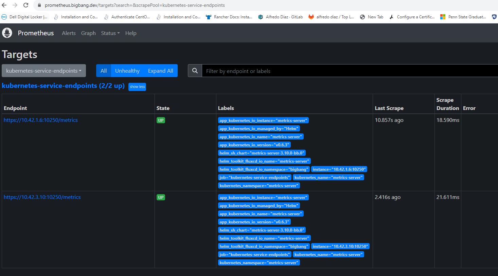

# Integrating Prometheus Label Scraping for sample application

## Introduction

Integrating Prometheus metrics scraping with label scraping services is crucial for effective monitoring. This process involves collecting metrics, storing them, and analyzing the results. Big Bang utilizes Prometheus as a monitoring service. Most packages provide built-in Prometheus metrics scraping or offer add-ons for metrics scraping. This guide will explain how to integrate metrics scraping for your service endpoint with Big Bang.

By default, global monitoring is enabled in Big Bang. If you wish to disable it, set `monitoring.enabled: false` in `bigbang/values.yaml`. Note that some services might allow only one serviceMonitor for scraping. If a service is already being scraped, you'll need to disable it and create a dedicated serviceMonitor for your package.

The built in Global serviceMonitor service is defined by the job name `kubernetes-service-endpoints` with following values in `bigbang/values.yaml`:
```
values: 
    prometheus:
      prometheusSpec:
     
        additionalScrapeConfigs:
          
          - job_name: 'kubernetes-service-endpoints'
    
            kubernetes_sd_configs:
              - role: endpoints
            scheme: https
            tls_config:
              insecure_skip_verify: true
            follow_redirects: true
            enable_http2: true 
            relabel_configs:
              - source_labels: [__meta_kubernetes_service_annotation_prometheus_io_scrape]
                action: keep
                regex: true
              - source_labels: [__meta_kubernetes_service_annotation_prometheus_io_scheme]
                action: replace
                target_label: __scheme__
                regex: (https?)
              - source_labels: [__meta_kubernetes_service_annotation_prometheus_io_path]
                action: replace
                target_label: __metrics_path__
                regex: (.+)
              - source_labels: [__address__, __meta_kubernetes_service_annotation_prometheus_io_port]
                action: replace
                target_label: __address__
                regex: ([^:]+)(?::\d+)?;(\d+)
                replacement: $1:$2
              - action: labelmap
                regex: __meta_kubernetes_service_label_(.+)
              - source_labels: [__meta_kubernetes_namespace]
                action: replace
                target_label: kubernetes_namespace
              - source_labels: [__meta_kubernetes_service_name]
                action: replace
                target_label: kubernetes_name
              - source_labels: [__meta_kubernetes_service_name]
                action: drop
                regex: '(.+)node-exporter'
              - source_labels: [__meta_kubernetes_service_name]
                action: drop
                regex: '(.+)dns'
              - source_labels: [__meta_kubernetes_service_name]
                action: drop
                regex: '(.+)kube-state-metrics'

```

## Prerequisites

Before integrating with Prometheus, ensure the following:

- Determine if the application supports Prometheus metrics exporting. If not, find a Prometheus exporter to provide this service.
- Check if the upstream Helm chart for the application (or exporter) natively supports Prometheus. Otherwise, you may need to create monitoring resources.
- Identify the path and port used to scrape metrics on the application or exporter.
- List the services and/or pods that should be monitored.

## Integration Steps

### 1. Define Placeholder Values

Add placeholders in `chart/values.yaml` to configure whether the monitoring stack (Prometheus) is enabled:
the following is an example of a placeholder for allowing  scraping of the `metrics-server` service endpoint:
```yaml
  metrics-server:
    values: 
      service:
        annotations:
          prometheus.io/scrape: "true"
          prometheus.io/port: "10250"
          prometheus.io/path: "/metrics"
      serviceMonitor:
        enabled: false  # set to true to enable monitoring if the service is not already being scraped     

note: The example above is for the metrics-server application, you will need to update the service annotations to match your application. Also note that metrics-server is already being scraped by a local serviceMonitor, so you will need to disable it so label scraping can be enabled.
```

Applications configured correctly will be scraped by Prometheus under the `target->` `kubernetes-service-endpoints` (see image below) in the Prometheus UI. If you do not know the correct port and path for your application, you may use `Service Discovery` in the Prometheus UI to find the correct port and path for your application.



