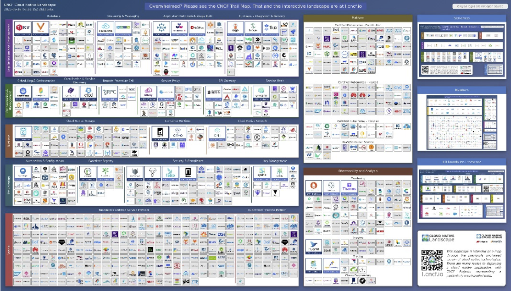
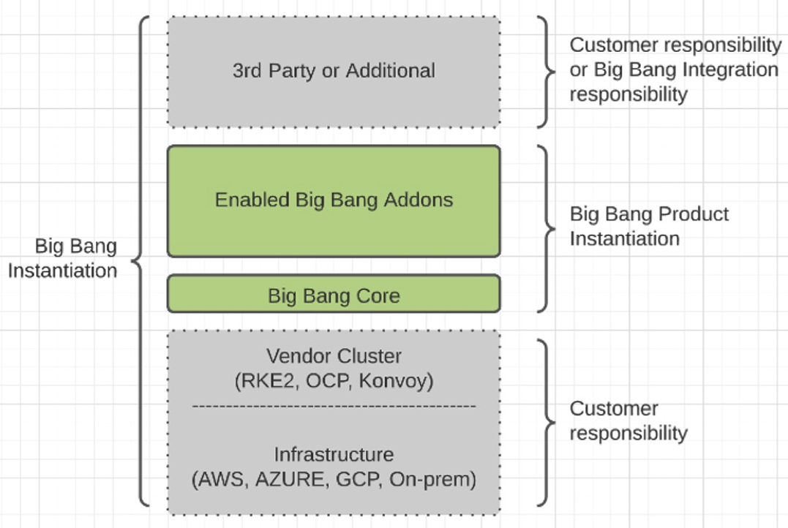

## What does Big Bang provide?
Big Bang is a Helm chart you can use to build a DevSecOps platform from DoD hardened and approved containers that are deployed to your Kubernetes cluster. Using Big Bang will help you build a custom software factory for your specific mission needs and develop and deploy your mission applications faster. Using Big Bang helps you ensure that your development environment follows the DoD DevSecOps reference design and will be more likely to receive a Continuous ATO.

Big Bang is:

* An umbrella Helm chart that leverages Iron Bank container images to provide a DevSecOps Platform where you can build and host apps.
* Installed on a Kubernetes Cluster that you provide. 
* Installed and managed using GitOps and Configuration as Code, and orchestrated using Flux V2.
* Open source, but leverages a mixture of open source and COTS software for each of the core and addon components.

You can find more information about Big Bang at https://p1.dso.mil/products/big-bang.

## Why use Big Bang
* Secure, stable, and efficient implementation of Kubernetes and DevSecOps. 
* Compliant with the DoD DevSecOps Reference Arch Design
* Faster deployments because infrastructure is defined as code.
* Decreases your security burden by using IronBank container images.
* Reduces maintenance burden by receiving app updates from P1's Big Bang Team.
* "SSO for free." Instead of building SSO into apps, developers can label their pods "protect=keycloak" to automatically integrate SSO with their application.
* It allows groups to collaborate and reuse secure solutions. 

## How is Big Bang Offered?

1. Through the Big Bang Customer Integration Team. This is a paid service. The Integration Team helps you set up and maintain a Big Bang environment that you host in your own environment. As part of our tech-fit evaluation, our engineers will work with you to determine the level of support and services needed.
2. Through the Party Bus team. Also a paid service. Party Bus is a multi-tenant environment hosted, managed, and supported by the Platform One Party Bus team.
3. Big Bang Open Source. You deploy Big Bang on your own in your environment and contribute back code/documentation. See https://repo1.dso.mil/platform-one/big-bang/customers/template to get started. 

## Big Bang vs. Party Bus
When you host your environment on Party Bus it uses PartyBus CICD pipelines and processes on underlying Platform One infrastructure. Because of this, your environment can leverage Party Bus's cATO, which P1's AO (Authorizing Official) has already approved.

On the other hand, simply installing Big Bang in your environment does not guarantee a cATO or ATO. Big Bang users who host thier own environment must work with their AOs to get an ATO/cATO.
