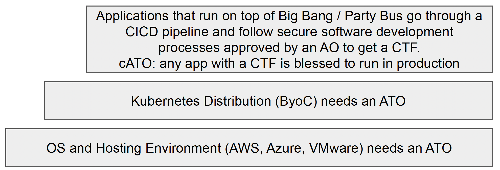

## What does Big Bang provide?
Big Bang is a DevSecOps platform built from DoD hardened and approved packages deployed in a customer owned Kubernetes cluster. Big Bang will help you build a custom software factory for your specific mission needs to enable faster development and deployment of your mission applications. Big Bang is basically a Set of Applications defined by Kubernetes IaC/CaC that can be deployed to a Kubernetes Cluster and Managed using GitOps.
The end result is a platform that can receive a Continuous ATO, because it follows the DoD DevSecOps reference design.

Big Bang is:

* An Umbrella Helm Chart that leverages Iron Bank Container Images
* Installed on a pre-existing Kubernetes Cluster
* It's installed and managed using GitOps and Infrastructure as Code
    * Big Bang Core is installed using Flux(V2) io! 
    * Addons can be installed using Flux or ArgoCD.
* An instance of Big Bang is a DevSecOps Platform that can build and host apps
* Open Source Software.

Additional information on Big Bang can be found at https://p1.dso.mil/products/big-bang.

## Why use Big Bang
* With DevSecOps proper implementation is key
* Big Bang implements Kubernetes + DevSecOps the right way
* Compliant with the DoD DevSecOps Reference Arch Design
* Can receive a cATO, because we're compliant with the DoD Enterprise DevSecOps Reference Design.
* Deployments can be sped up, because we're defined as code.
* Lessens your security burden, by using DoD approved IronBank Container Images.
* Lessens your maintainability burden by receiving app updates from P1's BB Team: 
    * When you edit the version of the BB UHC in your git repo from 1.1.0 -> 1.1.1, the Umbrella Helm Chart Pattern makes it so all the apps under the umbrella will automatically update.
* "SSO for free" (from the user experience of DoD Developers):
    * Instead of building SSO into apps, developers can label their pods "protect=keycloak" and the platform automatically integrates SSO with their application.
* A Platform for the DoD to standardize against that allows groups to collaborate and reuse secure solutions. We have folks prototyping Big Data and ML OPs pipelines, as those mature they can be upstreamed, and the IaC can be reused by others in the DoD.

We make sense of this for you, and give you secure options.

## How is BigBang Offered?
Big Bang turns Iron Bank Container Images into Deployable Apps Repo One, Iron Bank, Party Bus, SSO, and more are all hosted on instances of Big Bang

1. BigBang's Paid Product Offering: "Deployment of BigBang as a service"
    * Specifically the deployment of BigBang into a DoD customer's environment. As part of the process a customer’s git repo will be created that will reflect the customer's choice of deployment environment, configuration, and selection of BigBang Apps.
2. PartyBus: "BigBang as a Multi-tenant managed service"
    * PartyBus is an instance of a BigBang Deployment, that hosts a multi-tenant env, managed and supported by the PartyBus team.
3. BigBang Open Source: "DIY self install of BigBang from open sourced components"
    * You deploy Big Bang on your own and contribute back code/documentation
    * https://repo1.dso.mil/platform-one/big-bang/customers/template

## BigBang Deployment

* The BigBang Product assumes ByoC (Bring your own Cluster)
* It's designed to be deployed to a pre-existing cluster
* Platform One can work with a vendor/partner to bundle Infrastructure IaC and
automation to form a Kubernetes Cluster
* A customer git repo, representing an instance of the BigBang Product

## Big Bang vs. Party Bus
A big difference between Big Bang and Party Bus is that using Party Bus means you're using PartyBus's CICD pipelines and processes so apps can get a CTF (Certificate to Field) and leverage Party Bus's cATO, which inherit Platform One's ATOs of the underlying infrastructure, which P1's AO (Authorizing Official) has approved.

Installing Big Bang does not mean that you automagically get a cATO or ATO. Consumers of Big Bang need to work with their AOs to get an ATO/cATO. Big Bang Customers are able to get support from Platform One's security team to help with this.

