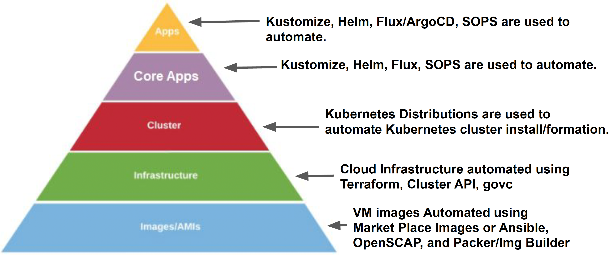
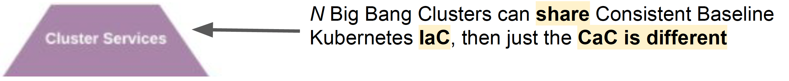
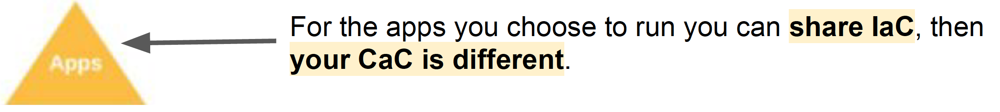

## Layered Archtiecure
Every Layer of the Cluster Should be defined as IaC/CaC and automated.

### VM Layer
Different Deployment Environments have different types of VM Images:
  * AWS has AMIs: Amazon Machine Images
  * Azure has Azure Managed VM Images
  * VMware has .vmdk Images

Packer is used to automatically build VM Image types that match the deployment environment.
  * Utilize a tool called Packer with an ansible-remote provisioner to execute Ansible Playbooks against a remote host as part of the Image Creation Process.
      * OpenSCAP: public ansible scripts to bring a VM to STIG compliance/C2S hardened.
      * Inspec: Tests & verifies infrastructure configuration

### Infrastructure Provisioning Layer
Terraform is used to automate the creation of infrastructure, and it provisions VMs using the VM Images created in the previous layer.

Terraform can be used to define Networking, Supporting Services, and VMs as Code, and automate their provisioning.

It works for AWS, Azure, VMware and others.

### Kubernetes Layer
Kubernetes Distributions are like Linux Distributions Big Bang Clusters come in flavors:
* "Upstream Kubernetes" (kubeadm/archosaur/dod-tanzu)
* Konvoy (Managed Kubernetes Cluster by D2IQ)
* Rancher Kubernetes Engine
* RedHat's OpenShift Container Platform (BOY*)
* (and more)

### Cluster Services Layer
"Core" Non-Negotiable Services that you'd find in every Big Bang Cluster:
  * Flux
  * Istio
  * Open Policy Agent
  * Prometheus operator stack (Prometheus Grafana AlertManager)
  * Logging operator stack (Elastic FluentD Kibana)

### Applications Layer
Applications that can be added or removed based on the needs of a particular customer.  ArgoCD umbrella app will deploy applications defined in a git repo to the cluster.
 

## GitOps Goals vs. Expectations
GitOps requires tight coupling of IaC and CaC:

* If you destroy a pre-existing stateless* cluster or dev cluster spun up using GitOps. A replacement can be quickly spun up(< 1 hour)
* The fast redeployment time is dependent on prerequisites and configuration which can't always be automated / easily streamlined.
    * Deploying a similar cluster in the same AWS account can be figuredout in a day.
    * Deploying a new cluster in a new AWS account, air gapped environment, or locked down environment where prerequisites andconfiguration involves "hand offs" between teams, can put you in asituation where the initial deployment can still take 1-3 weeks of prep work.