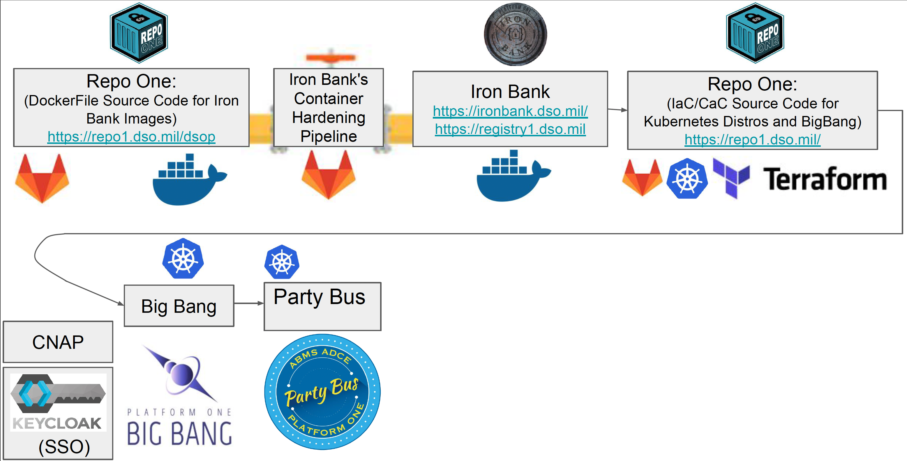

## What is Platform One?
Platform One (P1) is a security-first approach to developing secure software for military weapon systems. It follows industry best practices and enables the Department of Defense (DoD) to manage DevSecOps internally. P1 is a large team of highly talented individuals from the U.S. Air Force and other innovation hubs. With Platform One, users can establish a DevSecOps Software Factory and start solving software issues with a 90% solution from day one, eliminating the need to start from scratch.

More information on Platform One can be found at https://p1.dso.mil/

## How P1 Services Fit Together
Big Bang transforms Iron Bank Container Images into deployable application repositories. Instances of Big Bang host Repo One, Iron Bank, Party Bus, SSO, and other components.

