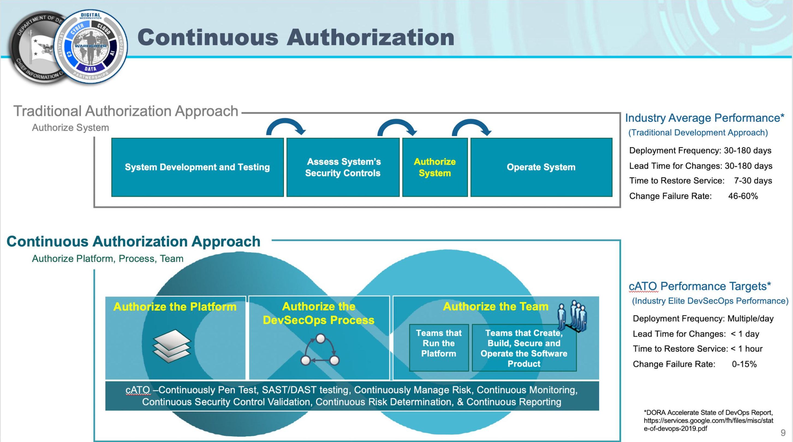
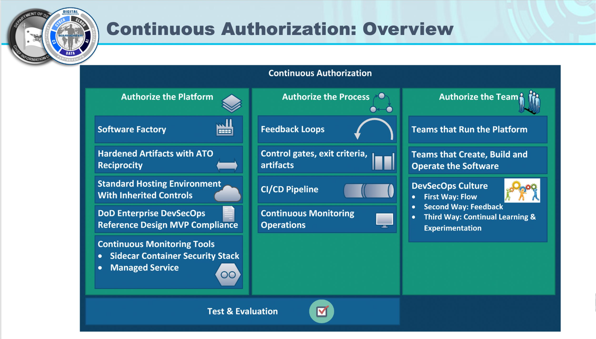
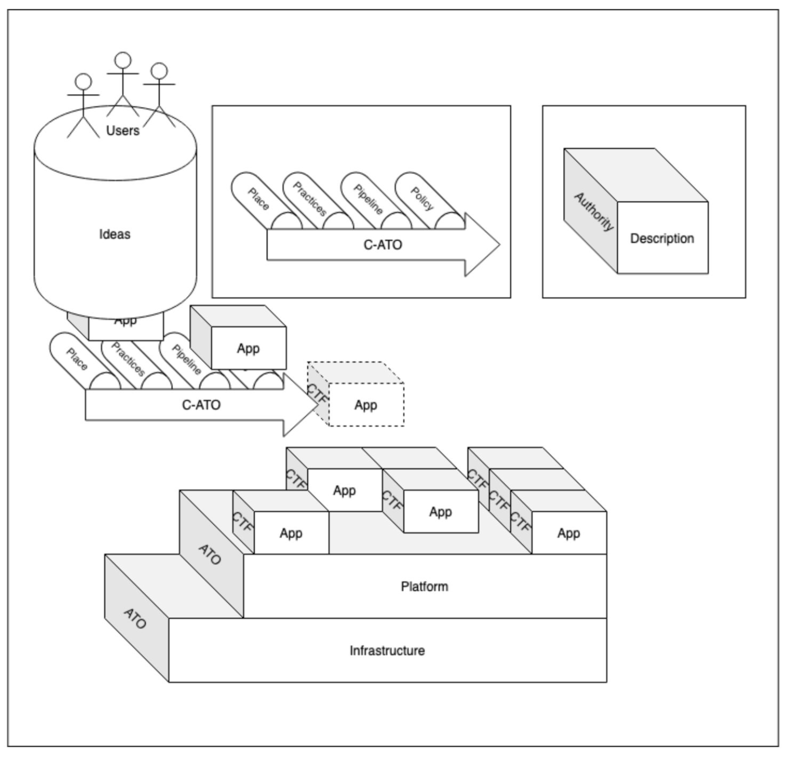
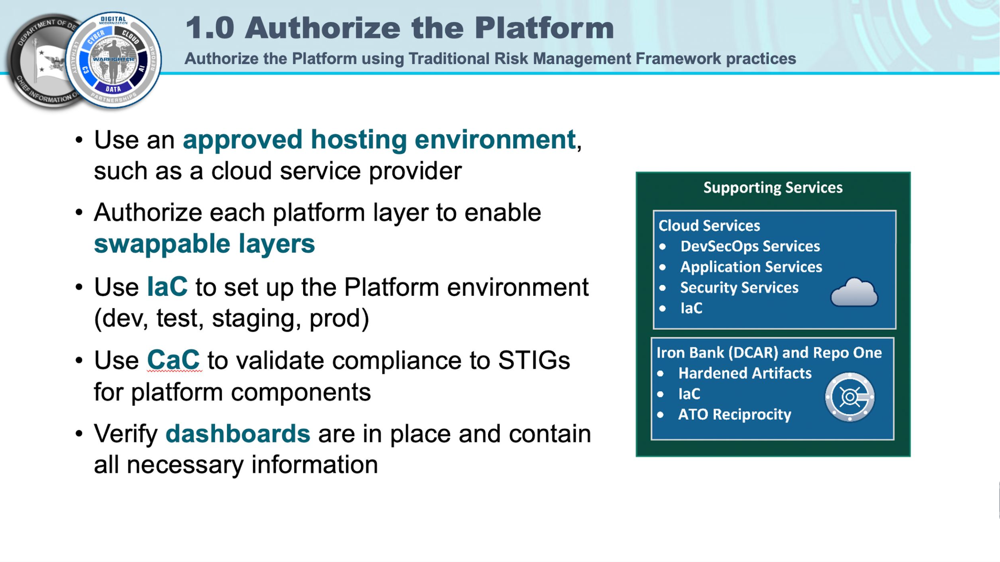
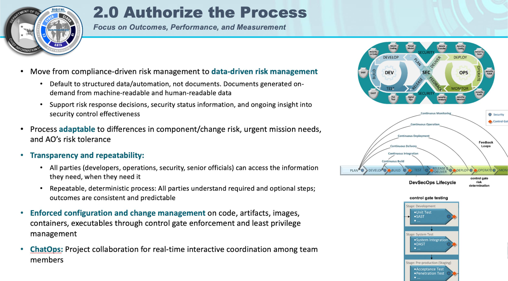
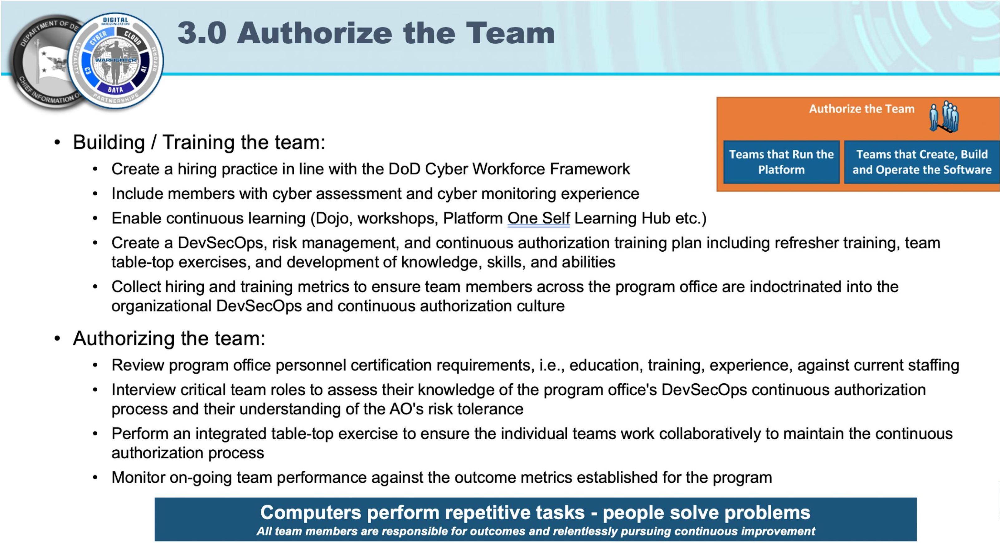
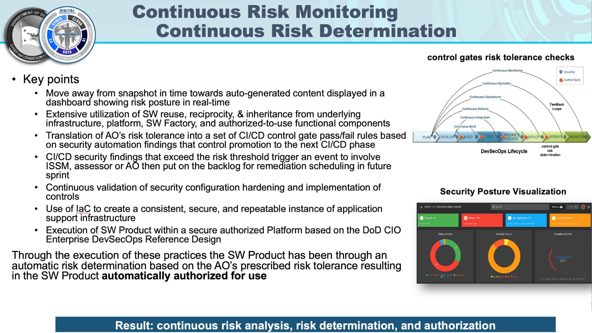

# Security in Platform One

## Core Tenets

* **Secure the DoD**
    * Security first approach - but with mindfulness of timelines 
* **Automation**
    * Avoid manual processes - by automating 
* **Standards/Continuous Monitoring**
    * Observability layers can continuously monitoring of compliance over time.
* **Multi-Party Validation**
    * Have multiple sets of eyes that are checking the products coming through the pipeline. P1 likes to promote pair programming to help with this.

## PlatformOne - Security Offerings

* **IronBank Registry**
    * IB registry for hardened container images (registry1.dso.mil)
* **IronBank VAT**
    * Vulnerability Assessment Tracker (vat.dso.mil)
    * GUI with APIs access to evidence to speed up accreditation of images
* **Weekly IronBank Onboarding, AMA, and get unblocked sessions**
    * https://p1.dso.mil/#/products/iron-bank/
    * Note: only vendors can harden vendor images
* **CNAP**
    * Cloud Native Access Point (Advanced perimeter firewall, that enables secure access to IL2, IL4, and IL5 Resources from the public internet, P1 SSO managed by CNAP team)
* **Various other services**
     * Onboarding, pen testing, and more.

## Automating Security

* IronBank rebuilds & rescans their images every 12 hours. This ensures fixes to the upstream base image can be added.
* BigBang's UHC Pattern and every 2 week release cycle makes it easy to pull in the latest version of images.
  In `~/Desktop/bootstrap/dev/kustomization.yaml` there's a reference to the version of the BigBang helm Chart. When you update that it cases a cascading effect that updates the versions of all images maintained by BigBang.

## ATO vs cATO

### ATO
* Based on RMF and Security Controls and their implementation for an iteration
* Places focus on the the system
* Works better with the traditional Waterfall/Spiral SDLC
* Changes to the system might warrant a re-evaluation of the ATO cycle
* Traditionally ATO is issued to the system as whole
* Does not lend to easier reciprocity across platforms

### cATO
* Also based on RMF and Security Controls but focuses on the process that spans multiple iterations
* Places focus on the development process instead of the system
* Better fit for modern agile methodologies
* Allows teams to develop and deploy continuously without having to re-evaluate ATO for each change
* Swapping out the layers (Infra and Platform) with equivalent ATOs helps preserves cATO and CtF of the Application which lends to easier reciprocity across platforms (arguably)

## Continuous Authorization

## PlatformOne Security Objectives

Security is core to P1’s Mission

“Serve cyber mission application teams in their journey to deliver rapid mission capability with technical expertise and services”

* Provide secure, resilient and robust development environment
* Facilitate CtF - Certificate To Field
* Secure development - focus on high quality code practices, automation, monitoring and compliance
* Secure deployment - rely on the ATO of the infrastructure and platform layers

## Process

### 1.0 Authorize the Platform

### 2.0 Authorize the Platform

### 3.0 Authorize the Process

### Continuous Monitoring

## P1 and cATO
BigBang clusters are eligible to receive a cATO.

IronBank, PartyBus, and other P1 services are hosted on BigBang Clusters. In addition to BigBang platform technology, trained and vetted people develop and maintain Big Bang services and follow processes that have been approved by the AO. Because of this, P1's AO was able to sign off on P1 services receiving a cATO.

EX: PartyBus has a process for developer built images to be approved to run in production on the cATO'd environment, they call it the CTF (Certificate to Field).