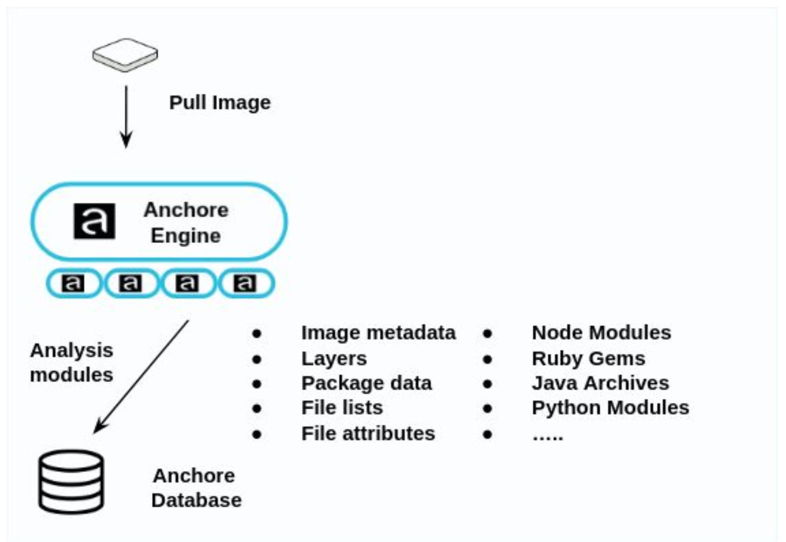
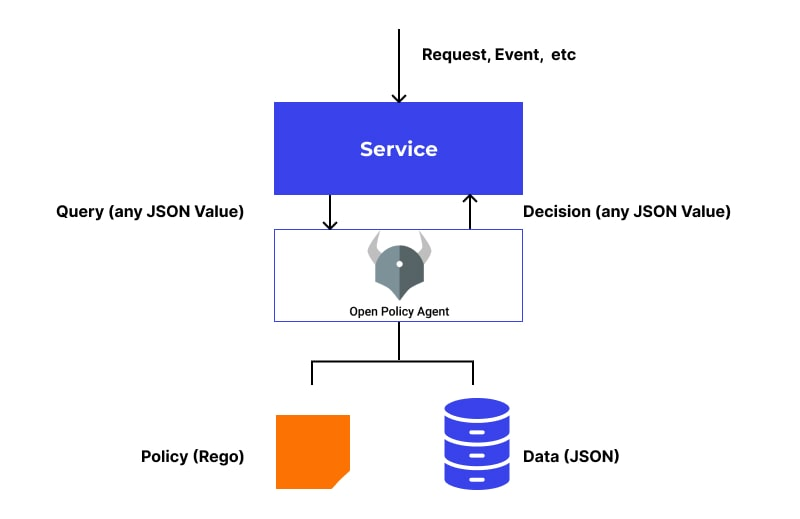
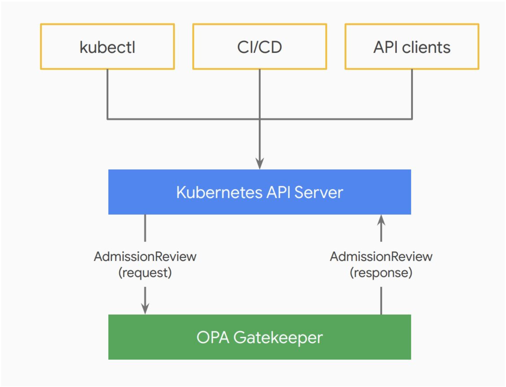

# Security Tools

## Keycloak

* What is a keycloak ?
    * single sign-on solution
    * open source
    * Compliant with standard protocols like OIDC and SAML so it can integrate with many identity providers
* P1's implementation allows SSO with CAC cards (a plugin is integrated that can federate against the x509 certs associated with CAC cards)

### AuthService (Authentication Proxy)

Envoy, Istio's proxy engine, has a feature to protect workloads with an authentication proxy, where you can force users to authenticate with an SSO provider before they see the service behind the authentication proxy.

AuthService is a BigBang supported Addon

### AuthService, KeyCloak, and BigBang

* AuthService is a BigBang addon. When enabled its default configuration will point to [Keycloak](https://login.dso.mil), P1's hosted SSO solution. 
* BigBang's Authentication Proxy can interface with any OIDC/SAML id provider, not just KeyCloak.
* If you want AuthService to point to your own instance of Keycloak instead of P1's hosted keycloak, you can deploy the keycloak BigBang addon (a non-standard addon).

What makes Keycloak a non-standard addon is that usually running all the addons you like in 1 big cluster would be considered supported. In the case of Keycloak it's recommended to deploy it into its own dedicated cluster.

## Anchore

* [Anchore Engine](https://github.com/anchore/anchore-engine) is an open-sourced container security platform.  
* Anchore is a service that analyzes docker images and scans for vulnerabilities. It is an optional add-on to Big Bang. 
* Anchore features include
    * Container Image analysis
    * Policy Management
    * Continuous monitoring
    * CI/CD Integration
    * Integration with Kubernetes

### Image Analysis

* During image analysis, software libraries and files are inspected and stored in the Anchore DB
* Anchore also watches the image repository for updates to a given container tag

### Policy Management

* Policy management adds another level to container scanning including
    * Package allow/block lists
    * Configuration file contents
    * Image manifest changes
    * Presence of credentials in images
* Each policy can be a Stop or Warn
* When scanning, any stop actions will cause a pipeline to fail

## Open Policy Agent

* **Policy**
    * “Rules that tell us whether we can create a resource or make change an existing resource”
* **Policy Management**
     * “The practice of developing, deploying and using policy objects”
* **Open Policy Agent**
    * Open Policy Agent (OPA) is a general-purpose policy engine with uses ranging from authorization and admission control to data filtering.
* **Goals**
    * “Stop using a different policy language, policy model, and policy API for every product and service you use. Use OPA for a unified toolset and framework for policy across the cloud native stack.”

### Config vs Policy Management

**Config Management**
* Lets you define/store/control configuration for a resource
* Config mgmt is the process itself and solutions include GitOps
* Config management only enforces the end cluster resource state
* Helps with defining and implementing configuration as code (CaC)

**Policy Management**
* Lets you govern the resource changes
* Allows the enforcement over the process - whether a change can be applied or denied
* Policies can admit/deny/audit new or existing cluster resources
* Helps with governance, compliance and auditing of the policies

### OPA Architecture

## Gatekeeper

Gatekeeper is a wrapper on an OPA implementation that functions as a validating admission controller webhook inside a k8s cluster

* Validation of Policy Controls
* Policies / Constraints
* Audit Functionality
* Data replication

Gatekeeper is a core package in BigBang

## Prisma

* Prisma can be used in two primary ways
    * As a build time image scan/analysis/reporting tool
    * As a runtime monitoring tool
        * IDS
        * IPS
* Prisma is a Big Bang package, but licenses are not provided
* Prisma for Kubernetes
    * Deployed as a Daemonset in the cluster
    * Monitors Node Settings like:
        * IP-tables
        * FirewallD
        * Open Ports
        * Container Syscalls on the host
