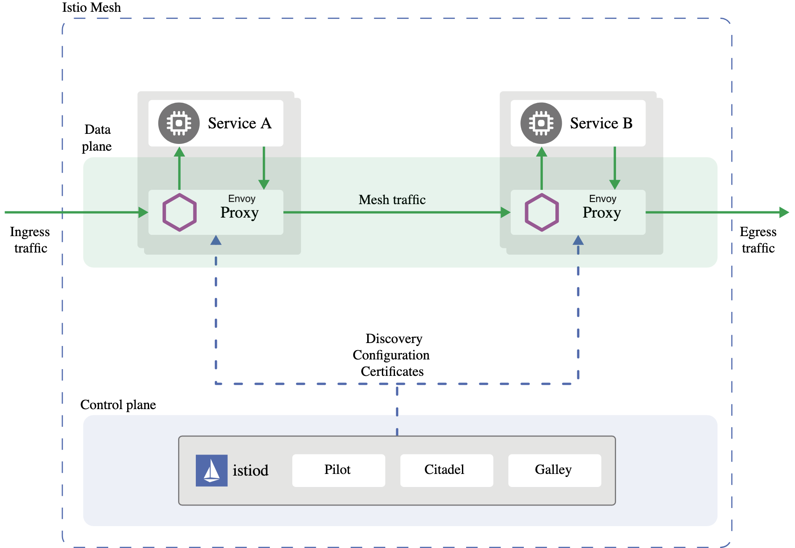

# Istio Architecture

To explain how Istio works, we will introduce two services - service A and service B that are talking to each other. The first and the most critical piece of the mesh and Istio is deploying Envoy beside every application. We call this a sidecar deployment.

This sidecar intercepts all of the network traffic in and out of the application and it gives us the point to apply policies and the resiliency features mentioned. The network is the interface point with the outside world, and if we can capture that we can do a lot of fancy stuff.

The collection of these Envoys are Istio’s data plane. We have a set of Envoys sitting there, but now we need a way to configure them and to give them behavior. This is where the Istio Control Plane comes in, the Istio’s control plane is in the istiod binary.

`Galley` is Istio’s management plane. It’s like an API server that’s responsible for taking configuration from the configuration store (in Kubernetes, Galley talks to the Kubernetes API server for configuration),  validating it and pushing it to other Istio components.

`Pilot` is the piece responsible for taking configuration from `Galley` (these are the things we write in YAML - things like Gateways, VirtualServices, networking config and so on). `Pilot` combines that with view of the world that it gets from the set of service registry - in kubernetes we go and talk to kubernetes API server to get the services that exist in the system ,what are their endpoints.

`Pilot` takes these things and builds a model of what the mesh should be and it realizes that into configuration for Envoys and it pushes it to the Envoys that control the runtime behavior. In addition to distributing the network configuration, Pilot also distributes policies.

Final piece is called `Citadel` and it’s responsible for identity issuance and certificate rotation. Istio mints x.509 certificates - these are the certs you would typical use for things like terminating a website for HTTPS. But the certs Istio mints are ephemeral - they only live for a couple of hours - they encode the identity of the service and we do that authentication of the service, issue the identity and then that identity is used at runtime.

We call that a SPIFFE identity to each workload in the mesh.

SPIFFE stands for secure production identity framework for everyone and it provides a secure identity in a form of a specially crafted x.509 certificate. For more information about SPIFFE please read [here](https://spiffe.io/).

Now that they have identities we can start enforcing policies (authorization or authz).

Since Envoy is running alongside your application it transparently intercepts the call. The way it does that is by modifying the iptables rules and intercepting any incoming and outgoing traffic. Since we are inside Kubernetes, containers within the Pod share the network space - so any iptables rules modification that’s made by the init container inside the Pod will be preserved and apply to other containers within the pod.

Transparently here means that service A is not aware that the request is being intercepted. So when service A makes a request to service B, Envoy needs to determine the actual destination and forward the request. We don’t necessarily know that there’s an Envoy on the other side, the client is oblivious. But we forward the request, B happens to have another sidecar and that sidecar intercepts the request and checks the destination's identity. The server Envoy, also referred to as the upstream Envoy, checks the sender's identity. Then Envoy checks the policy to see if it should let the request forward or not. This is where we can apply our service to service communication policy and decide if the call should go through or not. So let’s assume the request goes through, then Envoy will forward that to B and B does the work it needs to do to assemble the answer and call other services. Eventually B prepares the response and it sends it back over the network. Again, Envoy intercepts that response, forwards it back to the client that requested it.  The client envoy forwards it back to the destination application, A.

Let us zoom out a bit and recap. At a high level, we have a data plane and a control plane. Data plane is a collection of Envoy proxies that run next to your applications.  And, Envoy intercepts communication and applies policy.

The control plane is a single binary called istiod with the following components: `Galley` for configuration validation and distribution, `Pilot` to configure and push service configuration, and `Citadel` for identity and credential management.

## Next

With Istio installed and a proper environment, we are ready to deploy an application to the mesh.