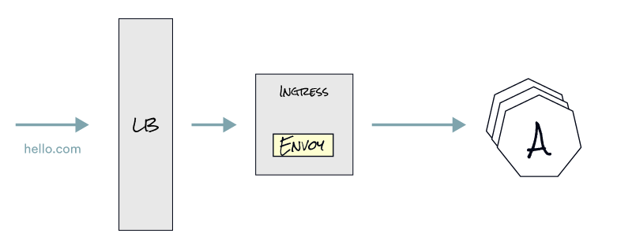
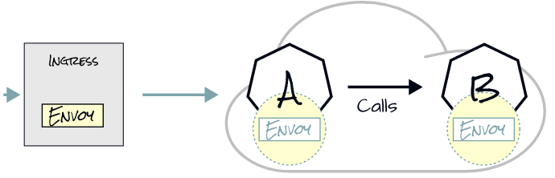

# Ingress

Going back to our example, service A calling service B, the same thing happens if there’s an ingress involved in-front. If we configure `hello.com` to point to the load balancer's IP address, and the load balancer to send traffic to the ingress controller, a request for `hello.com` would be routed to the ingress controller, in our case that’s Envoy proxy. Then, based on the routing rules, the ingress controller routes the request to Service A. From there service A can call Service B.

Istio uses ingress gateways to configure load balancers executing at the edge of a service mesh. An ingress gateway allows you to define entry points into the mesh that all incoming traffic flows through.

We can configure an ingress gateway by using the `Gateway` Istio resource. You use a `Gateway` resource to manage inbound and outbound traffic for your mesh, letting you specify which traffic you want to enter or leave the mesh. `Gateway` configurations are applied to standalone Envoy proxies that are running at the edge of the mesh, rather than sidecar Envoy proxies running alongside your service workloads.

Is important to note that the `Gateway` resource doesn't define routing rules or traffic shifting concerns, instead for this purpose, Istio's API provides the `VirtualService` and `DestinationRule` resources that we'll explain in detail in the traffic shifting chapter.

## In summary, what can we say about Ingress?

* Ingress Pod runs in istio-system namespace
* Configured logically in Kubernetes with the `Gateway` custom resource
* Routing configured separately with `VirtualService` and `DestinationRule` resources

## Next

In the next lab, we expose the `web-frontend` using an Istio Ingress Gateway.

This will allow us to access this application on the web.