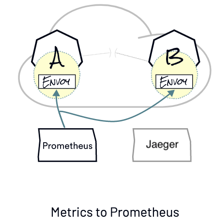
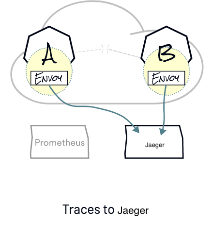
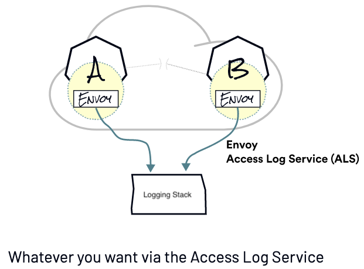

# Observability

When we talk about observability we are usually grouping concerns about logging, metrics and tracing within others. Istio facilitates the accessibility to these concerns by providing out of the box instrumentations for metrics, logging and tracing enabled by Envoy.

Prometheus is a time-series DB that can scrape the Envoys for metrics about the traffic flowing through our mesh. Prometheus is configured in such a way that it looks for certain annotations on the pods to get the metrics and index them. For more information about Prometheus, read [here](https://prometheus.io/).

Once you’re collecting the metrics using Prometheus, we can use something like Grafana to visualize them. Grafana is an open source analytics and interactive visualization web application for centralized dashboards. For more information about Grafana, read [here](https://grafana.com/).

In addition to Prometheus/Grafana, you can also install [Kiali](https://kiali.io/) and [Zipkin](https://zipkin.io/) or [Jaeger](https://www.jaegertracing.io/). Kiali is the management console for Istio service mesh, it could be installed as an add-on and it could be a trusted part of your production environment. And Zipkin or Jaeger are Istio's tools for distributed tracing.

As part of BigBang offering, Jaeger, Kiali, Prometheus and Grafana (`monitoring`) can be installed using Helm values and these are enabled by default.

Distributed tracing enables users to track a request that is distributed across multiple services. This allows a deeper understanding about request latency, serialization and parallelism via visualization.

Istio leverages Envoy’s distributed tracing features to provide tracing integration out of the box.

Finally, logging concerns are addressed by Envoy's Access log service (ALS) which you could configure to any other logging stack.

## Next

The application is now running and exposed on the internet.

In the next lab, we explore with the observability features that are built in to Istio.