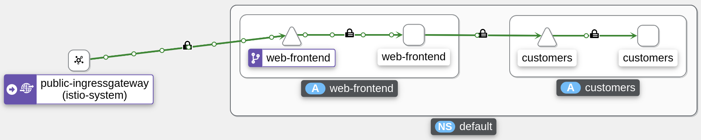
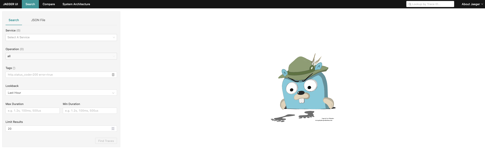

# Observability Lab

This lab explores one of the main strengths of Istio: observability.

The services in our mesh are automatically observable, without adding any burden on developers.

## Deploy the Addons

The Istio distribution provides addons for a number of systems that together provide observability for the service mesh:

- [Zipkin](https://zipkin.io/){target=_blank} or [Jaeger](https://www.jaegertracing.io/){target=_blank} for distributed tracing
- [Prometheus](https://prometheus.io/){target=_blank} for metrics collection
- [Grafana](https://grafana.com/){target=_blank} provides dashboards for monitoring, using Prometheus as the data source
- [Kiali](https://kiali.io/){target=_blank} allows us to visualize the mesh

In the Istio distribution these addons are located in the `samples/addons/` folder. But as part of BigBang offering, these addons are enabled by default.

??? tip

    If you find the observability components are not enabled, you can deploy each addon by making sure your `values.yaml` file contain the following:

    ```yaml
    jaeger:
    enabled: true
    ```

    ```yaml
    monitoring:
    enabled: true
    ```

    ```yaml
    kiali:
    enabled: true
    ```

    Upgrade using helm and your values file:
        ```bash
        helm upgrade --install bigbang $HOME/bigbang/chart \
        --values https://repo1.dso.mil/platform-one/big-bang/bigbang/-/raw/master/chart/ingress-certs.yaml \
        --values $HOME/ib_creds.yaml \
        --values $HOME/demo_values.yaml \
        --namespace=bigbang --create-namespace
        ```

1. Verify that the `kiali` namespace is now running additional workloads for each of the addons.

    ```{.shell .language-shell}
    kubectl get pod -n kiali
    ```

1. Verify that the `monitoring` namespace is now running additional workloads for each of the addons.

    ```{.shell .language-shell}
    kubectl get pod -n monitoring
    ```

1. Verify that the `jaeger` namespace is now running additional workloads for each of the addons.

    ```{.shell .language-shell}
    kubectl get pod -n jaeger
    ```

With the upstream distribution of Istio, you use `istioctl` CLI commands for accessing the web UIs for each dashboard. In BigBang you need to edit your `/etc/hosts` file to associate your public IP with the domains below:

```{.shell .language-shell}
echo $GATEWAY_IP grafana.bigbang.dev kiali.bigbang.dev tracing.bigbang.dev prometheus.bigbang.dev | sudo tee -a  /etc/hosts
```

## Generate a load

In order to have something to observe, we need to generate a load on our system.

### Install a load generator

Install a simple load generating tool named [`siege`](https://github.com/JoeDog/siege){target=_blank}.

We normally install `siege` with the `apt-get` package manager.
However, given the cloud shell's ephemeral nature, anything installed outside our home directory will vanish after a session timeout.

Alternatives:

1. Install from source. It's a little more work, but does not exhibit the above-mentioned problem.
1. Run the load generator from your laptop.  On a mac, using homebrew the command is `brew install siege`.

Here are the steps to install from source:

1. Fetch the package

    ```{.shell .language-shell}
    wget http://download.joedog.org/siege/siege-latest.tar.gz
    ```

1. Unpack it

    ```{.shell .language-shell}
    tar -xzf siege-latest.tar.gz
    ```

1. Navigate into the siege subdirectory with `cd siege`++tab++

1. Run the `configure` script, and request that siege get installed inside your home directory

    ```{.shell .language-shell}
    ./configure --prefix=$HOME
    ```

1. Build the code

    ```{.shell .language-shell}
    make
    ```

1. Finally, install (copies the binary to `~/bin`)

    ```{.shell .language-shell}
    make install
    ```

Feel free to delete (or preserve) the downloaded tar file and source code.

### Generate a load

With `siege` now installed, familiarize yourself with the command and its options.

```{.shell .language-shell}
siege --help
```

Run the following command to generate a mild load against the application.

```{.shell .language-shell}
siege --delay=3 --concurrent=3 --time=20M http://$GATEWAY_IP/
```

!!! note

    The `siege` command stays in the foreground while it runs.
    It may be simplest to leave it running, and open a separate terminal in your cloud shell environment.

## Kiali

Launch the Kiali dashboard, open in a new browser tab `kiali.bigbang.dev`:

!!! warning

    The address above is only resolvable by a browser if you updated your machine hosts file to match it with your instance's public IP.

!!! tip
    Kiali offers 5 options for authentication. Big Bang will default to using the token method. The token method uses the Kubernetes service account token for authentication. To get the default Kiali SA token for login see [here](https://repo1.dso.mil/platform-one/big-bang/apps/core/kiali/-/blob/main/docs/Login.md).

The Kiali dashboard displays.

Customize the view as follows:

1. Select the _Graph_ section from the sidebar.
1. Under _Select Namespaces_ (at the top of the page), select the `default` namespace, the location where the application's pods are running.
1. From the third "pulldown" menu, select _App graph_.
1. From the _Display_ "pulldown", toggle on _Traffic Animation_ and _Security_.
1. From the footer, toggle the legend so that it is visible.  Take a moment to familiarize yourself with the legend.

Observe the visualization and note the following:



- We can see traffic coming in through the ingress gateway to the `web-frontend`, and the subsequent calls from the `web-frontend` to the `customers` service
- The lines connecting the services are green, indicating healthy requests

Such visualizations are helpful with understanding the flow of requests in the mesh, and with diagnosis.

Feel free to spend more time exploring Kiali.

We will revisit Kiali in a later lab to visualize traffic shifting such as when performing a blue-green or canary deployment.

## Jaeger

Launch the dashboard, open in a new browser tab `tracing.bigbang.dev`:



- Click on the service dropdown and select the service `web-frontend.default`
- Click on the _Find Traces_ button (green) at the bottom.

A number of query results will display.  Each row is expandable and will display more detail in terms of the services participating in that particular trace.

- Hover over and click to the right of one of the traces having four (4) spans.

The resulting view shows spans that are part of the trace, and more importantly how much time was spent within each span.  Such information can help diagnose slow requests and pin-point where the latency lies.

Distributed tracing also helps us make sense of the flow of requests in a microservice architecture.

## Prometheus

Prometheus works by periodically calling a metrics endpoint against each running service (this endpoint is termed the "scrape" endpoint).  Developers normally have to instrument their applications to expose such an endpoint and return metrics information in the format the Prometheus expects.

With Istio, this is done automatically by the Envoy sidecar.

### Observe how Envoy exposes a Prometheus scrape endpoint

1. Capture the customers pod name to a variable.

    ```{.shell .language-shell}
    CUSTOMERS_POD=$(kubectl get pod -l app=customers -ojsonpath='{.items[0].metadata.name}')
    ```

1. Run the following command:

    ```{.shell .language-shell}
    kubectl exec $CUSTOMERS_POD -it -- curl localhost:15090/stats/prometheus  | grep istio_requests
    ```

    The list of metrics returned by the endpoint is rather lengthy, so we just peek at "istio_requests" metric.  The full response contains many more metrics.

### Access the dashboard

1. Start the prometheus dashboard, open in a new browser tab `prometheus.bigbang.dev`.

1. In the search field enter the metric named `istio_requests_total`, and click the _Execute_ button (on the right).

1. Select the tab named _Graph_ to obtain a graphical representation of this metric over time.

    Note that you are looking at requests across the entire mesh, i.e. this includes both requests to `web-frontend` and to `customers`.

2. As an example of Prometheus' dimensional metrics capability, we can ask for total requests having a response code of 200:

    ```text
    istio_requests_total{response_code="200"}
    ```

3. With respect to requests, it's more interesting to look at the rate of incoming requests over a time window.  Try:

    ```text
    rate(istio_requests_total[5m])
    ```

There's much more to the Prometheus query language ([this](https://prometheus.io/docs/prometheus/latest/querying/basics/){target=_blank} may be a good place to start).

Grafana consumes these metrics to produce graphs on our behalf.

## Grafana

1. Launch the Grafana dashboard, open in a new browser tab `grafana.bigbang.dev`.

    !!! tip
        The default Grafana username is "admin" and the password value can be obtained as follows:

        ```bash
            kubectl get secret -n monitoring monitoring-monitoring-grafana -o=jsonpath='{.data.admin-password}' | base64 -d
        ```

1. Click on the magnifying glass and search for _Istio_ to reveal pre-designed Istio-specific Grafana dashboards
1. Explore the Istio Mesh Dashboard.  Note the Global Request Volume and Global Success Rate.
1. Explore the Istio Service Dashboard.  First select the service `web-frontend` and inspect its metrics, then switch to the `customers` service and review its dashboard.
1. Explore the Istio Workload Dashboard.  Select the `web-frontend` workload.  Look at outbound services and note the outbound requests to the customers service.  Select the `customers` workload and note that it makes no outbound services calls.

Feel free to further explore these dashboards.

## Next

We turn our attention next to security features of a service mesh.
