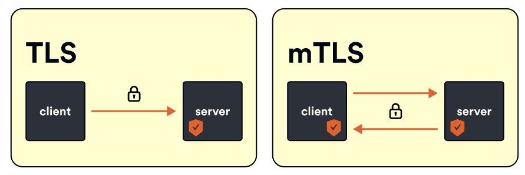
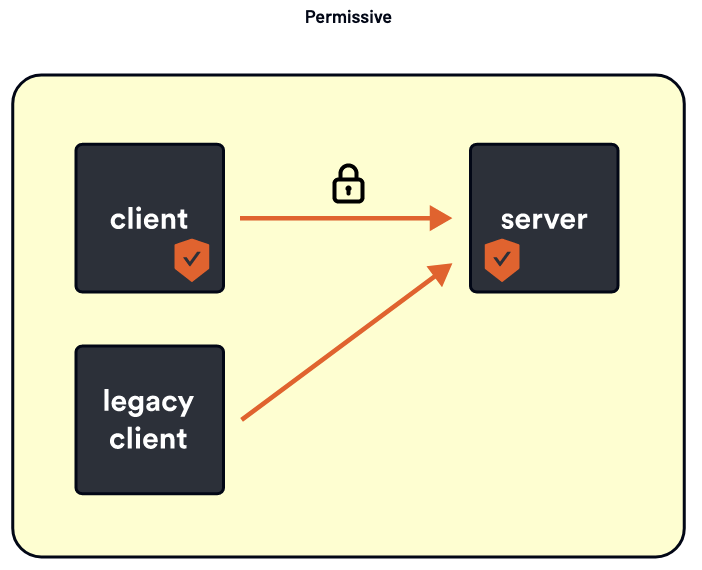
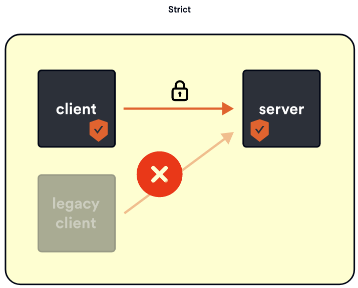

# Security

Authentication or `authn` is all about the `principal`, or if we’re talking about service, it’s about service identity. When we refer to the entity that can be authenticated by a computer system or network or other type of appliances, we referred to it as a `principal`.

Principals can be people, computers, services or abstractions like threads or processes. These principals need to be authenticated, meaning they need to be identified by an identity provider before they can be assigned rights or privileges over resources they can act upon.

When we say we are performing authentication we are validating some sort of a credential and ensuring that credential is valid and trusted.

Once the authentication succeeds, we can talk about an authenticated `principal`. If the credential is not valid or can’t be trusted we say that we have an unauthenticated `principal` OR we didn’t even have a `principal` to authenticate in the first place.

An example of authentication is when you’re traveling and you have to present your passport or an ID to the customs officer, they are the ones that authenticate your passport or ID and ensure that it’s valid and trusted.

## SPIFFE Overview

In Istio, each workload is assigned a unique identity that it uses to communicate with other workloads, this identity comes in the form of a Kubernetes `ServiceAccount`. This service account is the identity Pods use and present at runtime. Istio uses the X.509 certificate from the service account and it creates a new identity according to the spec called [SPIFFE](https://spiffe.io/) (secure production identity framework for everyone):

* X.509 certificate (from SA) + SPIFFE spec = IDENTITY
* SPIFFE is a spec that describes:
    * A naming scheme for workload identities
    * spiffe://cluster.local/ns/default/sa/my-sa
    * How to encode those names into a X.509 certificate
    * How a client Validates an X.509 certificate to authenticate the SPIFFE identity inside of it

In general terms, SPIFFE says, if you have X.509 AND you handle it this way AND you authenticate it the standard way AND after you’ve authenticated it the standard way, you check the subject alternate name, then it’s a valid SPIFFE identity - it is an authenticated principal.

At runtime we take these certificates are do mutual TLS, the Envoy proxies are modified so when they do the TLS handshake they will do that extra bit required by SPIFFE validation and those authenticate principals (both source and destination) are made available for policy.

## Mutual TLS (mTLS)

Traditionally when we do TLS is one way, you go to the browser, to google.com and you’ll see the lock and look at the certificate. But I didn’t give google any proof of my identity, I just made a request. This is where mutual TLS is fundamentally different. When two services try to communicate with mutual TLS, it’s required that both of them provide certificates to each other, so both parties can authenticate the identity of the other.

Mutual TLS is great and you should have it turned on for all your services. However, there might be scenarios where you have legacy applications that do not supporting mutual TLS yet.  And, there is a timing challenge of enabling mutual TLS simultaneously on multiple services.

Let’s suppose we want to enable mutual TLS across our deployment. You have a chicken and egg problem if you want to do mutual TLS - a connection will either be mutual TLS or not.

The client connecting to a server via mutual TLS where the server is not accepting mutual TLS doesn’t work. And a server attempting to serve mutual TLS where a client wants plain text communication doesn’t work either.

That means, if I want to just enable mutual TLS I have to redeploy client and server in a coordinated manner at the same time.  This is impossible! You can’t do that reliably and even if you magically do it somehow, it won’t be repeatable.

Fortunately, Istio has a graceful mode where we can opt into mutual TLS - it’s called permissive mode.

Permissive mode is enabled by default when you install Istio. With permissive mode enabled, if a client tries to connect to me via mutual TLS, I'll serve mutual TLS. If the client doesn't use mutual TLS, I can respond in plain text as well. I am permitting the client to do mTLS or not. Using this mode you can gradually rollout mutual TLS across your mesh.

For your servers, you can turn on permissive mode and provision certificates. If a client wants to do mutual TLS, it will be accepted. The same with simple TLS. Then you can go to your clients and gradually roll out mutual TLS there. You can do that service per service and gradually opt in to mutual TLS.

Once you have moved all services over, you can remove permissive mode and set it to STRICT.

Strict mode says that you can only do mutual TLS; so if any client tries to connect they will have to do mutual TLS and present their certificate.

## Next

We turn our attention next to the `PeerAuthentication` and `RequestAuthentication` resources.