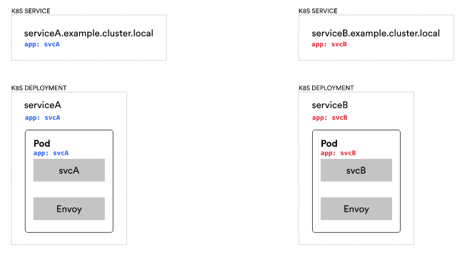
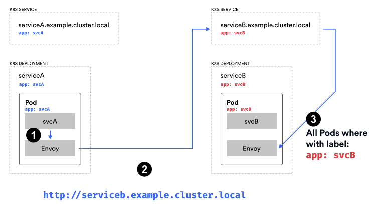
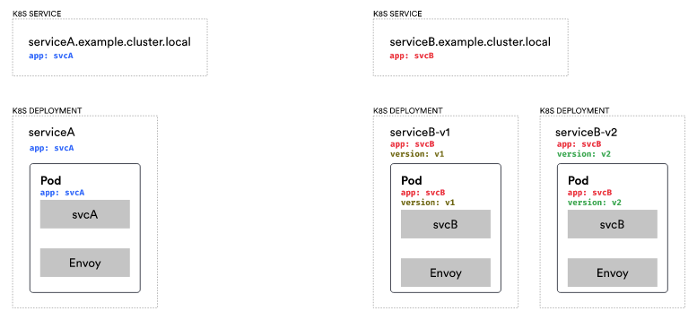
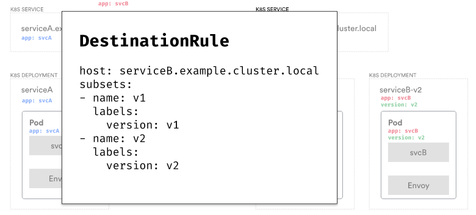
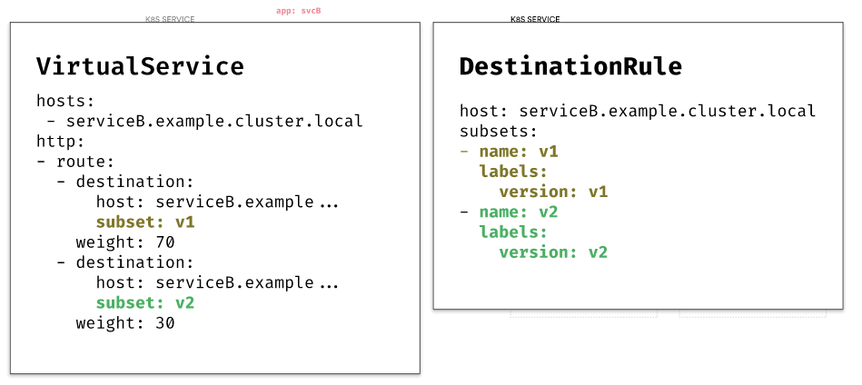
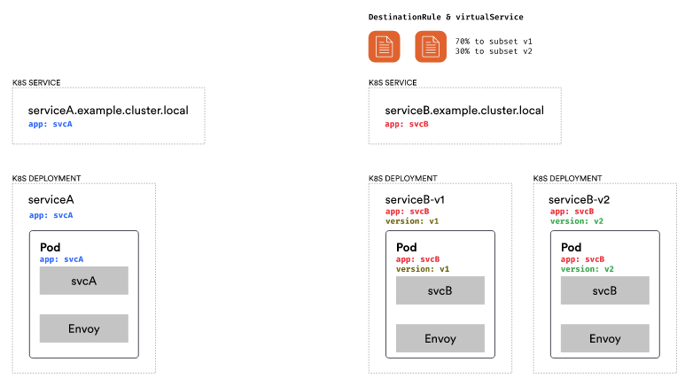
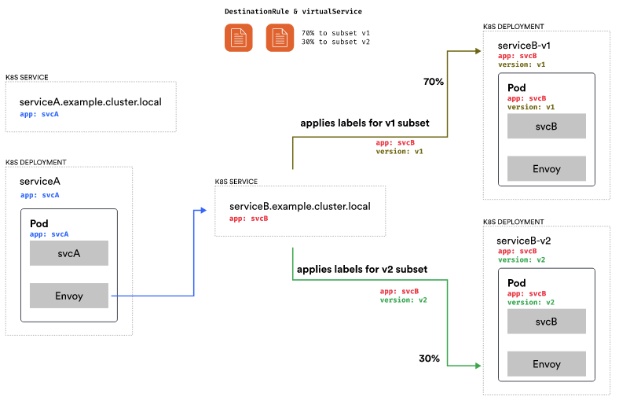
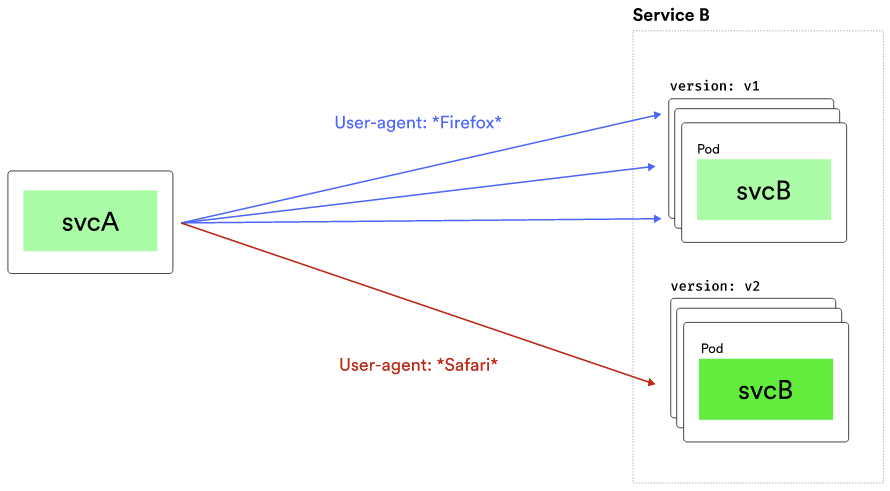

# Traffic Shifting

There a couple of terms and resources we have to talk about in order to describe how traffic shifting works and how we can route the traffic:

* `VirtualService`
    * Configures routing rules for each service
* `DestinationRule`
    * Configures how to reach the target endpoint.  This is applied after the routing decision has been made.

We will talk about multiple resources in Istio.  With the `VirtualService`, we can configure routing rules to each service; this is where we can also define traffic splitting, failure or delay injection, and traffic mirroring.

The `DestinationRule` resources contain any rules that get applied after routing decisions are made. They configure how to reach the target service. Here's where we could configure circuit breakers or TLS settings.

We'll also talk about `Gateways` and show how to configure Envoy that’s deployed as a traditional load balancer at the edge of our mesh. The `Gateway` resource controls how Envoy listens on the network interface and presents its certificates. For example, Istio gets deployed with an ingress gateway that can be used to expose Kubernetes services to the outside world.

Let's think about how the call is being made in Kubernetes from one service to another. We have a Kubernetes service called service A and a corresponding deployment and the Pods that get created as part of the deployment. We have the same for service B, a Kubernetes service and a deployment.



The thing that's important here are the labels set on the Pods as well as on the Kubernetes service. This is what tells Kubernetes which pods belong to the logical service.

So whenever we make a call to serviceb.example.cluster.local that Kubernetes service maintains a collection of endpoints which equal to the IP addresses of all pods that match the label set on the Kubernetes service.

The Kubernetes service automatically maintains the list of endpoints/the IP addresses. So it watches if any of the pods with those labels are created or deleted and updates the list accordingly.



In step 1 we make the call.  The call gets intercepted by the Envoy proxy and is routed to `serviceb.example.cluster.local`.  The service routes the call to one of the pod endpoints in its collection that's labeled with `app: svcB`.

This works fine when we have one version of service B, but how could we describe the system if we have multiple versions of service B? The answer is an Istio concept called `subsets` that use Kubernetes labels underneath.

Practically let's say we have service B version 1 and service B version 2 in the cluster. We'd represent that with two separate deployments. the V1 deployment would have a  label called `version: v1` and the V2 deployment would have a label called `version: v2`.

However, we'd only have a single Kubernetes service with the same label as before, `app: svcB`. If we'd make a request to serviceB now, the call will end up on one of the pods labeled with `app:svcB`, this could be a pod from deployment labeled v1 or a pod from deployment labeled v2.

We could create multiple Kubernetes services, one for `svcB-v1` and one for `svcB-v2`. However, that's not practical because from  SvcA we'd have to be explicit about which service we want to call. We want to always call the same Kubernetes service and decide on the version using configuration.



Subsets can be defined in the `DestinationRule` resources. This allows us to  describe the services or subsets of the services. In this example, we define two subsets called `v1` and `v2`. We specify the corresponding labels for each of these subsets. This is the first thing we have to do when routing the traffic, describe our services.



Then, we can use the `VirtualService` resource to say how we want to split the traffic. For example, we could create two identical destinations for service B, but add subsets and weights to each for splitting the traffic.

This configuration is telling Envoy to split the traffic destined to serviceB in such a way that 70% of the traffic goes to the subset called V1 and 30% goes to the subset called V2.



So assume we created the destination rule and virtual service resources that define the two subsets, v1 and v2, and split the traffic 70/30.



No changes were made on the service A side. We still make a call to `serviceB.example.cluster.local`. However, we have the destination rule with the subsets and the routing rule with the traffic split defined. So, Envoy will route 70% of all traffic to subset v1 and 30% of all the traffic to subset v2.

Let's assume the calculation has been made and the call should go to subset v1. The labels that are defined for subset v1, which is `version: v1` are applied to the pod selection.  In addition to the `app: svcB` label the `version:v1` label is applied as well. That gives us any pods with those two labels. Then, the normal load balancing happens between the pods with those labels.  The final endpoint's Envoy proxy receives the call and it gets passed through to service B.

Similarly, when the 30% case happens, the v2 labels get applied and the call ends up on one of the pods that run the v2 version of service B.



## Destination Rule

To recap, `DestinationRule` is used to define policies that get applied to traffic for certain services. In the previous examples, we had a destination rule for service B where we declared two subsets. Subsets are a way to configure different versions of the service.  They use labels to select pods that are part of the subset.

The other things we can configure in a destination rule are:

* Load balancer settings
* Connection pool settings
* Outlier detection
* TLS settings

With the connection pool settings, we can control the volume of connections to the service. This is where we configure circuit breakers for either TCP or HTTP connections,  the max. number of connections or requests, the max. number of retries, or the max. number of connection timeouts.

With outlier detection, we can control how unhealthy hosts get evicted from the load balancing pool. Outlier detection is a circuit breaker implementation that tracks the status of each individual host. If a host starts failing (e.g. 500 status code from HTTP, timeouts, connection errors), the failing host can be temporarily ejected out of the load balancing pool.  This means that none of the requests will get routed to the host.

For example, we could say that if there are more than 5 consecutive 500 errors from a host, consider it unhealthy and remove it from the load balancing pool.

Then, we need to decide for how long to eject it. Perhaps the failures were transient and the host will start behaving later. We could eject it for 5 minutes, or some other period of time.

We could also configure the maximum number of hosts we want to eject. For example, we could say that we only want to eject 50% of the total number of hosts and always leave a minimum of 50% running, regardless of whether they are failing or not.

Another setting is the `minHealthPercent`, using this setting we can say that we only want to enable outlier detection as long as a certain percentage of hosts are in healthy mode. When the percentage of healthy hosts falls under this threshold the outlier detection is disabled and load balancing will happen across all hosts (healthy or unhealthy).

## Virtual Service

With the `VirtualService` resource we can configure how to route traffic. We've already seen how to split traffic based on the percentage.  Inside this resource we can also define routing rules and matching criteria for traffic. The way it works is that we specify how to match specific traffic, by some request properties, and then specify where we want the traffic to be routed.

We can also redirect traffic to another service, rewrite the URIs and authority headers, or mirror traffic to a different service.

In order to test our services, we can inject timeouts, retries, and faults using our `VirtualService`.  For example, we could inject 5 second delays for 40% of the traffic going to service B. Or, we could say service B will return an HTTP 404 response for 20% of the requests. These feature are useful for testing service resiliency.

Another feature is the ability to configure Cross-Origin Resource Sharing (CORS) policies for a service. We could set the origins, methods, or other CORS settings for services.

Finally, we can also manipulate both request and response headers.  We could add or remove specific headers from the requests.

Here's an example of how we could split traffic based on the user agent.  If the user-agent header contains the word `Firefox`, the traffic goes to the v1 subset of service B. Otherwise, if it's any other user agent, it will go to v2.



Below is how we could write that configuration. First, we'd match the user agent header.  To match the value we could either use a regular expression or an exact string.  Then, we define the destination and the subset. In our case, the v1 subset of service B is used.

If the user-agent header doesn't match, we route to the subset v2. We can define multiple match conditions and also use either the AND semantics or OR semantics which will be explained further below.

```{.yaml .language-yaml}
hosts:
  - svcB.example.cluster.local
http:
- match:
  - headers:
      user-agent:
        regex: ".*Firefox.*"
  route:
  - destination:
      host: svcB.example.cluster.local
      subset: v1
- route:
  - destination:
      host: svcB.example.cluster.local
      subset: v2
```

In this example, the virtual service will check the value of the `x-debug` header. If the value exactly matches the string `dev` AND if the request URI starts with `/api/debug`, then we'll route to the v1 subset.

```{.yaml .language-yaml}
hosts:
  - svcB.example.cluster.local
http:
- match:
  - headers:
      x-debug:
        exact: dev
    uri:
      prefix: /api/debug
  route:
  - destination:
      host: svcB.example.cluster.local
      subset: v1
- route:
  - destination:
      host: svcB.example.cluster.local
      subset: v2
```

If we wanted to do the `OR` semantic and say either header matches that value or the URI prefix is `/api/debug`, we'd add another match block.  In the previous example, there was a single match block.  But now we have two of them -- one for headers, another one for URI.

```{.yaml .language-yaml}
hosts:
  - svcB.example.cluster.local
http:
- match:
  - headers:
      x-debug:
        exact: dev
  - uri:
      prefix: /api/debug
  route:
  - destination:
      host: svcB.example.cluster.local
      subset: v1
- route:
  - destination:
      host: svcB.example.cluster.local
      subset: v2
```

Here's an example of how we could configure retries and timeouts.  We have the percentage based traffic split and we're setting the timeout for subset v1 to 5 seconds and subset v2 to 0.5s. Additionally, we're defining the retry policy for all hosts connecting to 
 service B. We're specifying 3 retries, a 2 second per try timeout, and to only retry on connection failures.

```{.yaml .language-yaml}
hosts:
  - svcB.example.cluster.local
http:
- route:
  - destination:
      host: svcB.example.cluster.local
      subset: v1
    weight: 30
    timeout: 5s
  - destination:
      host: svcB.example.cluster.local
      subset: v2
    weight: 70
    timeout: 0.5s
  retries:
    attempts: 3
    perTryTimeout: 2s
    retryOn: connect-failure
```

## Next

In the next lab we show how to use Istio's traffic management features to upgrade the customers service with zero downtime.