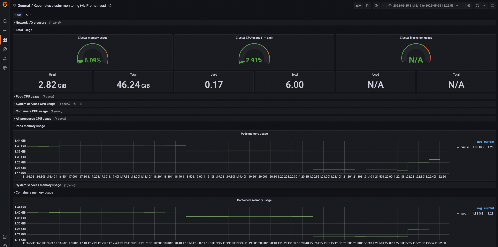
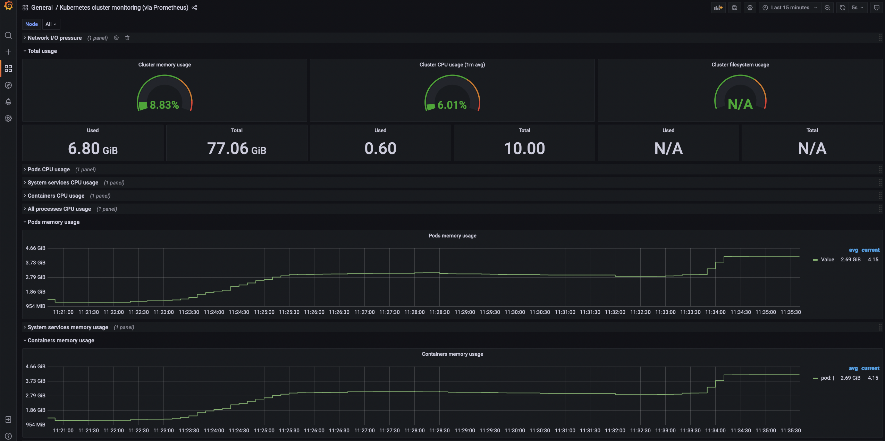
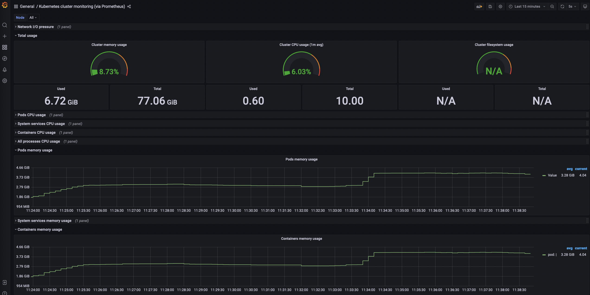
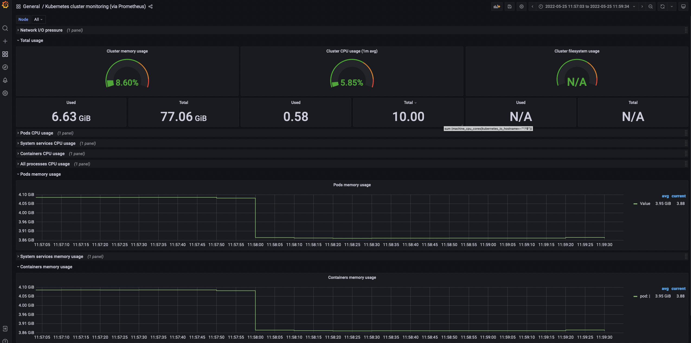

# Sidecar resource

As described on Istio's documentation [here](https://istio.io/latest/docs/setup/additional-setup/sidecar-injection/){target=_blank}, you can inject a sidecar proxy to your workload's pod, in two main ways:

- automatically by labeling the namespace
- manually using `istioctl`

But there is a third option:

- using the `sidecar` CRD, read more [here](https://istio.io/latest/docs/reference/config/networking/sidecar/){target=_blank}.

The CRD provides the ability to have fine-grained control over the sidecar configuration. The following example declares a global default `Sidecar` in the namespace  `istio-system`.  This configures all sidecars to allow egress traffic to other workloads in the same namespace and services in the `istio-system` namespace.

1. Study the Kubernetes yaml files: `sidecar-resource.yaml`:

    ??? tldr "sidecar-resource.yaml"
        ```yaml linenums="1"
        --8<-- "docs/docs/training/istio/artifacts/./sidecar-resource.yaml"
        ```

<!-- ```yaml
apiVersion: networking.istio.io/v1beta1
kind: Sidecar
metadata:
  name: default
  namespace: istio-system
spec:
  egress:
  - hosts:
    # See everything on my namespace
    - "./*"
    # See everything on istio-system ns
    - "istio-system/*"
``` -->

We are going to use the `sidecar` resource to improve resource utilization in our cluster. For this test we are using the `bookinfo` app on the `default` namespace and we are going to monitor our cluster resources using the `Kubernetes cluster monitoring` Grafana dashboard (315).

Introduced in the architecture chapter, we explained how Istio's control plane sends configuration by pushing it to the Envoy proxies. This configuration is translated from Istio's API resources to [Envoy](https://www.envoyproxy.io/) resources. In the Envoy configuration world, we need to be aware of these four main building blocks:

- Listeners: Envoy exposes listeners that are named network locations, either an IP address and a port or a Unix Domain Socket path. Envoy receives connections and requests through listeners.
- Routes: Matches the incoming requests by looking at the metadata (URI, headers, …) and, based on that, define where traffic is sent.
- Clusters: Group of similar upstream hosts that accept traffic. Clusters define a group of endpoints.
- Endpoints: Hosts or IP addresses on which your services are listening.

Now having the Envoy basics out of the way, we can use Istio's prefered tool for configuration management `istioctl` to inspect our Envoy proxy configuration, specifically the set clusters associated with it.

After deploying the `bookinfo` app on the `default` namespace, check the envoy's clusters to count how many of them are configured:

```bash
POD=$(kubectl get pod -l app=web-frontend -o jsonpath={.items[0].metadata.name})
istioctl proxy-config clusters $POD | grep -c ".*"
```

Expect a result along the lines of:
```bash
35
```

Now knowing the number of clusters we have for the `producpage` pod, lets check the memory consumption using the Grafana dashboard and note the memory usage for all pods:



Now lets use the following script to deploy 50 `sleep` pods in 50 namespaces:

??? tldr "deploy-svc.sh"
    ```bash linenums="1"
    --8<-- "docs/docs/training/istio/artifacts/./deploy-svc.sh"
    ```

<!-- ```bash
./deploy-svc.sh
``` -->

While the services get deployed take a look at the cluster memory consumption:



When all the services are deployed, check again the number of clusters defined for the `producpage` envoy proxy configuration:

```bash
istioctl proxy-config clusters $POD | grep -c ".*"
```

Expect a result along the lines of:
```bash
85
```

As you can see the configuration grew  significantly. This is because Istio, out of the box, assumes that all proxies within the mesh need to "talk" to each other.  Thus it creates a proportional amount of configuration for each proxy in the mesh.

In order to limit how the proxies interact with each other, we are going to apply the `sidecar` resource described previously that limits that interaction with the `istio-system` and the proxy's namespace:

```bash
kubectl apply -f sidecar-resource.yaml
```

After applying this resource check again the number of cluster connections for the `producpage` envoy proxy:

```bash
istioctl proxy-config clusters $POD | grep -c ".*"
```

Expect a result along the lines of:
```bash
34
```

The lower number indicates now we only have the cluster configuration for the `istio-system` and the proxy's namespace. Check the memory after applying the resource:



Although the sidecar resource did its purpose the memory is still allocated as seen above. You can wait a bit and see how the memory gets reclaimed or you can force purge it by running this script:

??? tldr "purge-mem.sh"
    ```bash linenums="1"
    --8<-- "docs/docs/training/istio/artifacts/./purge-mem.sh"
    ```

<!-- ```bash
./purge-mem.sh
``` -->

The previous script will go over all the `sleep` pods and the `bookinfo` pods and purge the memory reflected in the Grafana dashboard:



For cleanup run the following script:

??? tldr "delete-svc.sh"
    ```bash linenums="1"
    --8<-- "docs/docs/training/istio/artifacts/./delete-svc.sh"
    ```

<!-- ```bash
./delete-svc.sh
``` -->
