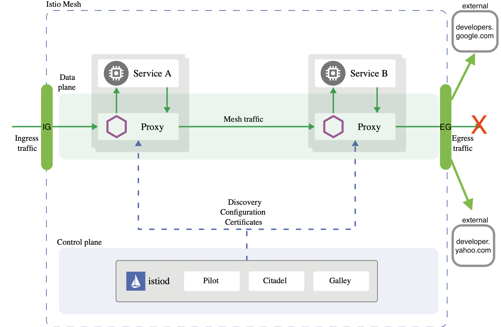

# Enforcing egress traffic using Istio's authorization policies

An Istio Egress gateway is just another envoy instance similar to the Ingress but with the purpose to control outbound traffic. Istio uses ingress and egress gateways to configure load balancers executing at the edge of a service mesh. An ingress gateway allows you to define entry points into the mesh that all incoming traffic flows through. Egress gateway is a symmetrical concept; it defines exit points from the mesh. Egress gateways allow you to apply Istio features, for example, monitoring and route rules, to traffic exiting the mesh.


This article describes how to enforce outbound authorization policies using Istio's Egress gateway in a similar matter when enforcing inbound policies. For this we use the `sleep` service in two separate namespaces within the mesh to access external services at Google and Yahoo.

!!! note

    One important consideration to be aware of is that Istio cannot securely enforce that all egress traffic actually flows through the egress gateways. Istio only enables such flow through its sidecar proxies. If attackers bypass the sidecar proxy, they could directly access external services without traversing the egress gateway. Kubernetes network policies can be used to prevent outbound traffic at the cluster level, for more information read [here](https://istio.io/latest/docs/tasks/traffic-management/egress/egress-gateway/#additional-security-considerations){:target="_blank"} and [here](https://kubernetes.io/docs/concepts/services-networking/network-policies/){:target="_blank"}.

***

## Prep-work

1. Install istio: See our guide to standup a minimal cluster with Istio on your VM [BigBang Quickstart](https://repo1.dso.mil/platform-one/big-bang/bigbang/-/blob/master/docs/guides/deployment_scenarios/quickstart.md)

1. Add an egress gateway instance by editing your `values` file. Add the following:
    ```yaml
    istio:
      postRenderers:
        - kustomize:
            patchesStrategicMerge:
            # Change operator deployment to be a rolling update
            - kind: IstioOperator
              apiVersion: install.istio.io/v1alpha1
              metadata:
                name: istiocontrolplane
                namespace: istio-system
              spec:
                components:
                  egressGateways:
                  - name: istio-egressgateway
                    enabled: true
    ```

!!! tip

    By default, Istio configures the handling of proxy accessing external services by using the `outboundTrafficPolicy` option. `ALLOW_ANY` is the default value to enabling access to outbound services and `REGISTRY_ONLY` gets the sidecar proxies to restrict access if the host is not defined in the service registry using the `ServiceEntry` resource.

### Deploy the sleep service

Label the namespace for sidecar injection:
```bash
kubectl label ns default istio-injection=enabled
```

1. Deploy `sleep` to the default namespace.

    ??? tldr "sleep.yaml"
        ```yaml linenums="1"
        --8<-- "docs/docs/training/istio/artifacts/sleep.yaml"
        ```

    ```{.shell .language-shell}
    kubectl apply -f sleep.yaml
    ```

1. Deploy the `sleep` service in the otherns namespace

```bash
kubectl create ns otherns
```

Label the namespace for sidecar injection:
```bash
kubectl label ns otherns istio-injection=enabled
```

```{.shell .language-shell}
kubectl apply -n otherns -f sleep.yaml
```

!!! tip

    If you run into image pull errors, you'll have to create a `private-registry` secret if deploying via BB, when pulling images from `registry1`.

### Export `sleep` pods name into variables

```bash
export SLEEP_POD1=$(kubectl get pod -l app=sleep -ojsonpath='{.items[0].metadata.name}')
```
```bash
export SLEEP_POD2=$(kubectl get pod -n otherns -l app=sleep -ojsonpath='{.items[0].metadata.name}')
```

### Test `sleep` accessing Google and Yahoo

```bash
kubectl exec $SLEEP_POD1 -it -- curl -I https://developers.google.com
```

You should expect a similar response like:
```
HTTP/2 200
last-modified: Mon, 18 Apr 2022 19:50:38 GMT
content-type: text/html; charset=utf-8
set-cookie: _ga_devsite=GA1.3.17352200.1651777078; Expires=Sat, 04-May-2024 18:57:58 GMT; Max-Age=63072000; Path=/
content-security-policy: base-uri 'self'; object-src 'none'; script-src 'strict-dynamic' 'unsafe-inline' https: http: 'nonce-6YT4DgbNb9SFKpYNAAh6BVQ1HrIWUp' 'unsafe-eval'; report-uri https://csp.withgoogle.com/csp/devsite/v2
strict-transport-security: max-age=63072000; includeSubdomains; preload
x-frame-options: SAMEORIGIN
x-xss-protection: 0
x-content-type-options: nosniff
cache-control: no-cache, must-revalidate
expires: 0
pragma: no-cache
x-cloud-trace-context: 3943a8b1bdf28d721eae4f82696ba2c4
content-length: 142275
date: Thu, 05 May 2022 18:57:58 GMT
server: Google Frontend
```

Now the other service:
```bash
kubectl exec $SLEEP_POD2 -n otherns -it -- curl -I https://developer.yahoo.com
```

You should expect a similar response like:
```
HTTP/2 200
referrer-policy: no-referrer-when-downgrade
strict-transport-security: max-age=15552000
x-frame-options: SAMEORIGIN
x-powered-by: Express
cache-control: private, max-age=0, no-cache
content-security-policy-report-only: default-src 'none'; connect-src 'self' *.yimg.com https://www.google-analytics.com *.yahoo.com *.doubleclick.net; font-src 'self' *.bootstrapcdn.com; frame-src 'self' *.soundcloud.com *.twitter.com; img-src 'self' data: *.yimg.com https://www.google-analytics.com *.yahoo.com https://www.google.com/ads/ga-audiences *.pendo.io *.twitter.com *.twimg.com; script-src 'self' 'nonce-25FqRrNIte3nmHy7Es/O4Q==' *.yimg.com https://www.google-analytics.com https://ssl.google-analytics.com *.github.com/flurrydev/ *.pendo.io *.twitter.com *.twimg.com; style-src 'self' 'unsafe-inline' *.yimg.com *.twitter.com *.twimg.com https://github.githubassets.com/assets/ *.bootstrapcdn.com; report-uri /csp-report
content-type: text/html; charset=utf-8
content-length: 61158
etag: W/"eee6-355CS9JqgK79WnB2sdI2zK9AvBw"
vary: Accept-Encoding
date: Thu, 05 May 2022 19:00:06 GMT
x-envoy-upstream-service-time: 2315
server: ATS
age: 3
expect-ct: max-age=31536000, report-uri="http://csp.yahoo.com/beacon/csp?src=yahoocom-expect-ct-report-only"
x-xss-protection: 1; mode=block
x-content-type-options: nosniff
```

If you want you can test the other other address on the other `sleep` pod. We can confirm the pods have outbound access to Google and Yahoo.

## Restrict outbound access

We need to modify the outbound traffic policy from `ALLOW_ANY` to `REGISTRY_ONLY` which enforces that only hosts defined with `ServiceEntry` resources are part of the mesh service registry; could be accessed by sidecars of the mesh:

1. Change the `outboundTrafficPolicy` by adjusting your values file:
    ```yaml
    istio:
      values:
        meshConfig:
          outboundTrafficPolicy:
            mode: REGISTRY_ONLY
    ```


### Test `sleep` access again

```bash
kubectl exec $SLEEP_POD1 -it -- curl -I https://developers.google.com
```

You should expect a similar response like:
```
curl: (35) OpenSSL SSL_connect: SSL_ERROR_SYSCALL in connection to developers.google.com:443
command terminated with exit code 35
```

Now the other service:
```bash
kubectl exec $SLEEP_POD2 -n otherns -it -- curl -I https://developer.yahoo.com
```

You should expect a similar response like:
```
curl: (35) OpenSSL SSL_connect: SSL_ERROR_SYSCALL in connection to developer.yahoo.com:443
command terminated with exit code 35
```

The error is due to the enforcement of the new policy that only allows outbound traffic to services that are part of the registry.

!!! note

    There could be a slight delay on the configuration being propagated to the sidecars. During this time, they still allow access to the external services.

***

### Add the Google and Yahoo services to the mesh service registry

Our Google `ServiceEntry` looks like this:
```yaml
apiVersion: networking.istio.io/v1beta1
kind: ServiceEntry
metadata:
  name: external-developers-google-com
spec:
  hosts:
  - developers.google.com
  exportTo:
  - "."
  location: MESH_EXTERNAL
  resolution: DNS
  ports:
  - number: 443
    name: https
    protocol: HTTPS
  - number: 80
    name: http
    protocol: HTTP
```

Apply the resource:
```bash
kubectl apply -f serviceentry-google.yaml
```
!!! note

    Notice the `exportTo: - "."` section of the service entry resource specifying that is only applicable to the current namespace where applied. You can also change this to `"*"` for all namespaces in the mesh.

Test access to the service:
```bash
kubectl exec $SLEEP_POD1 -it -- curl -I https://developers.google.com
```

You should expect a 200 response code now. But what if we test this `sleep` service to Yahoo?
```bash
kubectl exec $SLEEP_POD1 -it -- curl -I https://developer.yahoo.com
```

You should expect an error along the lines:
```
curl: (35) OpenSSL SSL_connect: Connection reset by peer in connection to developer.yahoo.com:443
command terminated with exit code 35
```

This is because we only allowed outbound traffic to Google from the default namespace where the `SLEEP_POD1` lives. Any outbound traffic from `SLEEP_POD2` should still be restricted, lets enabled traffic to Google:
```bash
kubectl apply -n otherns -f serviceentry-google.yaml
```

You should expect a 200 response code from both pods:
```bash
kubectl exec $SLEEP_POD2 -n otherns -it -- curl -I https://developers.google.com
```
```bash
kubectl exec $SLEEP_POD1 -it -- curl -I https://developers.google.com
```

Notice how Yahoo is still restricted on both services:
```bash
kubectl exec $SLEEP_POD1 -it -- curl -I https://developer.yahoo.com
```
```bash
kubectl exec $SLEEP_POD2 -n otherns -it -- curl -I https://developer.yahoo.com
```

Take a look at the Yahoo `ServiceEntry`:
```yaml
apiVersion: networking.istio.io/v1beta1
kind: ServiceEntry
metadata:
  name: external-developer-yahoo-com
spec:
  hosts:
  - developer.yahoo.com
  exportTo:
  - "."
  location: MESH_EXTERNAL
  resolution: DNS
  ports:
  - number: 443
    name: https
    protocol: HTTPS
  - number: 80
    name: http
    protocol: HTTP
```

Enable traffic on the default namespace and test it:
```bash
kubectl apply -f serviceentry-yahoo.yaml
```
```bash
kubectl exec $SLEEP_POD1 -it -- curl -I https://developer.yahoo.com
```

Now Yahoo on the `otherns` namespace:
```bash
kubectl apply -n otherns -f serviceentry-yahoo.yaml
```
```bash
kubectl exec $SLEEP_POD2 -n otherns -it -- curl -I https://developer.yahoo.com
```

You should expect a 200 response code from both pods. Any other request to other external hosts that are not Yahoo or Google should be restricted and only allowed if in the service registry from the default and otherns namespaces.

Notice how when the `ServiceEntry` resource is created in the target namespace, external communication to the defined host is allowed only from the `sidecar` proxies on that namespace.

### Cleanup

```bash
kubectl delete -f serviceentry-google.yaml
kubectl delete -n otherns -f serviceentry-google.yaml
kubectl delete -f serviceentry-yahoo.yaml
kubectl delete -n otherns -f serviceentry-yahoo.yaml
```

***

## Enforcing egress traffic using authorization policies

So far by changing the outbound traffic policy to `REGISTRY_ONLY` we can enforce how our proxy sidecars allow outbound traffic from the mesh to the external hosts only defined with our `ServiceEntry` resources, but we don't have a fine-grained control with them.

Using the service entries is more like a opening/closing a "faucet" in the namespace and having to create resources per namespace will create a maintenance burden. You can change the resource to be scoped for all namespaces ("*") and not just the target namespace but just with the `ServiceEntry` resource you can't control which workload within the namespace can or cannot access an external host.

We can accomplish this fine-grained control with an `AuthorizationPolicy` after we flow internally originated outbound traffic to the Egress gateway making act as a proxy with the help of `VirtualService`, `Gateway`, `DestinationRule` resources along with `ServiceEntry`s on how outbound traffic should flow.

In a similar manner when dealing with inbound traffic routing, we can create a `DestinationRule` that flows traffic from the sidecars to the egress gateway and a second `DestinationRule` that flows the traffic to the external host.

These `DestinationRule`s are bound to a `VirtualService` that matches traffic to the whole `mesh` `Gateway` and the `Gateway` defined for the external host. By doing this setup, we can rely on the `ServiceEntry` and `AuthorizationPolicy` resources to ensure that only allowed/denied outbound traffic defined for namespaces or principals (k8s ServiceAccount) can reach the external hosts.



!!! note

    Notice this example relies on Istio's automatic mutual TLS. This means services within the mesh send encrypted TLS traffic, but traffic external to the mesh may or may not be encrypted.  This is called `SIMPLE` TLS mode.  To force traffic to be TLS encrypted when leaving the mesh, known as TLS origination, we use `MUTUAL` TLS mode.  This can be setup in the `DestinationRule` by defining the secret name that holds the client credentials certificate. See more details [here](https://istio.io/latest/docs/tasks/traffic-management/egress/egress-gateway-tls-origination/#configure-mutual-tls-origination-for-egress-traffic).

***

### Route internal outbound traffic to the egress gateway

After deleting the `ServiceEntry` resources used on the previous section, make sure your mesh is still restricting outbound access.  Verify that there are no other resources that can conflict with the configuration like `DestinationRule`, `VirtualService`, `Gateway` or `AuthorizationPolicy` resources:

```bash
kubectl exec $SLEEP_POD1 -it -- curl -I https://developers.google.com
```
```bash
kubectl exec $SLEEP_POD2 -n otherns -it -- curl -I https://developers.google.com
```
```bash
kubectl exec $SLEEP_POD1 -it -- curl -I https://developer.yahoo.com
```
```bash
kubectl exec $SLEEP_POD2 -n otherns -it -- curl -I https://developer.yahoo.com
```

For all requests expect an error along the lines:
```
curl: (35) OpenSSL SSL_connect: Connection reset by peer in connection to developer.yahoo.com:443
command terminated with exit code 35
```

Analyze the following resources `external-google.yaml` and `external-yahoo.yaml`:

Google:
```yaml
apiVersion: networking.istio.io/v1alpha3
kind: ServiceEntry
metadata:
  name: google
spec:
  hosts:
  - developers.google.com
  ports:
  - number: 80
    name: http
    protocol: HTTP
  - number: 443
    name: https
    protocol: HTTPS
  resolution: DNS
---
apiVersion: networking.istio.io/v1alpha3
kind: Gateway
metadata:
  name: istio-google-egressgateway
spec:
  selector:
    istio: egressgateway # use Istio default gateway implementation
  servers:
  - port:
      number: 80
      name: https-port-for-tls-origination
      protocol: HTTPS
    hosts:
    - developers.google.com
    tls:
      mode: ISTIO_MUTUAL
---
# Routes internal outbound traffic to the egress gateway using Istio's mTLS
apiVersion: networking.istio.io/v1alpha3
kind: DestinationRule
metadata:
  name: egressgateway-for-google
spec:
  host: istio-egressgateway.istio-system.svc.cluster.local
  subsets:
  - name: google
    trafficPolicy:
      portLevelSettings:
      - port:
          number: 80
        tls:
          mode: ISTIO_MUTUAL
          sni: developers.google.com
---
apiVersion: networking.istio.io/v1alpha3
kind: VirtualService
metadata:
  name: direct-google-through-egress-gateway
spec:
  hosts:
  - developers.google.com
  gateways:
  - istio-google-egressgateway
  - mesh
  # route HTTP traffic to developers.google.com through the egress gateway for the entire mesh
  http:
  - match:
    - gateways:
      - mesh # apply to sidecars in the mesh
      port: 80
    route:
    - destination:
        host: istio-egressgateway.istio-system.svc.cluster.local
        subset: google
        port:
          number: 80
  # at the egress gateway, route developers.google.com to the real destination outside the mesh
  - match:
    - gateways:
      - istio-google-egressgateway
      port: 80
    route:
    - destination:
        host: developers.google.com
        port:
          number: 443
      weight: 100
---
apiVersion: networking.istio.io/v1alpha3
kind: DestinationRule
metadata:
  name: originate-tls-for-developers-google-com
spec:
  host: developers.google.com
  trafficPolicy:
    loadBalancer:
      simple: ROUND_ROBIN
    portLevelSettings:
    - port:
        number: 443
      tls:
        mode: SIMPLE # initiates HTTPS for connections to developers.google.com
```

Yahoo:
```yaml
apiVersion: networking.istio.io/v1alpha3
kind: ServiceEntry
metadata:
  name: yahoo
spec:
  hosts:
  - developer.yahoo.com
  ports:
  - number: 80
    name: http
    protocol: HTTP
  - number: 443
    name: https
    protocol: HTTPS
  resolution: DNS
---
apiVersion: networking.istio.io/v1alpha3
kind: Gateway
metadata:
  name: istio-yahoo-egressgateway
spec:
  selector:
    istio: egressgateway # use Istio default gateway implementation
  servers:
  - port:
      number: 80
      name: https-port-for-tls-origination
      protocol: HTTPS
    hosts:
    - developer.yahoo.com
    tls:
      mode: ISTIO_MUTUAL
---
# Routes internal outbound traffic to the egress gateway using Istio's mTLS
apiVersion: networking.istio.io/v1alpha3
kind: DestinationRule
metadata:
  name: egressgateway-for-yahoo
spec:
  host: istio-egressgateway.istio-system.svc.cluster.local
  subsets:
  - name: yahoo
    trafficPolicy:
      portLevelSettings:
      - port:
          number: 80
        tls:
          mode: ISTIO_MUTUAL
          sni: developer.yahoo.com
---
apiVersion: networking.istio.io/v1alpha3
kind: VirtualService
metadata:
  name: direct-yahoo-through-egress-gateway
spec:
  hosts:
  - developer.yahoo.com
  gateways:
  - istio-yahoo-egressgateway
  - mesh
  # route HTTP traffic to developers.google.com through the egress gateway for the entire mesh
  http:
  - match:
    - gateways:
      - mesh # apply to sidecars in the mesh
      port: 80
    route:
    - destination:
        host: istio-egressgateway.istio-system.svc.cluster.local
        subset: yahoo
        port:
          number: 80
  # at the egress gateway, route developer.yahoo.com to the real destination outside the mesh
  - match:
    - gateways:
      - istio-yahoo-egressgateway
      port: 80
    route:
    - destination:
        host: developer.yahoo.com
        port:
          number: 443
      weight: 100
---
apiVersion: networking.istio.io/v1alpha3
kind: DestinationRule
metadata:
  name: originate-tls-for-developer-yahoo-com
spec:
  host: developer.yahoo.com
  trafficPolicy:
    loadBalancer:
      simple: ROUND_ROBIN
    portLevelSettings:
    - port:
        number: 443
      tls:
        mode: SIMPLE # initiates HTTPS for connections to developer.yahoo.com
```

In the previous resources you can find:

- `ServiceEntry` resources to enable external access to Google and Yahoo
- `Gateway` resources for each host configuring the egress gateway instance for originating traffic to the external host
- `VirtualService` resources for each host bound for the entire mesh.  This includes the configuration for matching traffic from within the mesh (sidecars) and routing it through the egress gateway and outbound to the external host.
- `DestinationRule` resources applied to the traffic after being routed by the `VirtualService`.  The first rule defines internal traffic using the `sni` (hostname) and sets up Istio's automatic mTLS:  `ISTIO_MUTUAL`. The second `DestinationRule` defines how to initiate HTTPS connections to the external host.

Apply these resources and test accessing the services:

```bash
kubectl apply -f external-google.yaml -n istio-system
```
```bash
kubectl apply -f external-yahoo.yaml -n istio-system
```

!!! note

    This time we are applying all these resources on the `istio-system` namespace where the egress gateway instance resides. This is with the intention to easily manage egress traffic where the egress gateway instance resides, facilitating the management of the `AuthorizationPolicy`s.

***

!!! tip

    If you run into issues like 503 errors, make sure you disable `BigBang` networkPolicies by doing:
    ```yaml
    networkPolicies:
      enabled: false
    ```

Access `developers.google.com`:
```bash
kubectl exec $SLEEP_POD1 -it -- curl -I http://developers.google.com
```

Expect a 200 response along the lines:
```
HTTP/1.1 200 OK
last-modified: Mon, 18 Apr 2022 19:50:38 GMT
content-type: text/html; charset=utf-8
set-cookie: _ga_devsite=GA1.3.878699971.1652214977; Expires=Thu, 09-May-2024 20:36:17 GMT; Max-Age=63072000; Path=/
content-security-policy: base-uri 'self'; object-src 'none'; script-src 'strict-dynamic' 'unsafe-inline' https: http: 'nonce-yp4hjMbNOIwavPWy28V4k9lOdtSb6X' 'unsafe-eval'; report-uri https://csp.withgoogle.com/csp/devsite/v2
strict-transport-security: max-age=63072000; includeSubdomains; preload
x-frame-options: SAMEORIGIN
x-xss-protection: 0
x-content-type-options: nosniff
cache-control: no-cache, must-revalidate
expires: 0
pragma: no-cache
x-cloud-trace-context: 61c3fe6ffc0bc6bc209d455b04d9d86e
content-length: 142287
date: Tue, 10 May 2022 20:36:17 GMT
server: envoy
x-envoy-upstream-service-time: 420
```

!!! tip

    If you run into issues like 503 errors, make sure you disable `BigBang` networkPolicies by doing:
    ```yaml
    networkPolicies:
      enabled: false
    ```

Tail the logs of the `istio-proxy` sidecar:
```bash
kubectl logs $SLEEP_POD1 -f -c istio-proxy
```

Expect an entry from the sidecar to the egress:
```
[2022-05-10T20:36:16.973Z] "HEAD / HTTP/1.1" 200 - via_upstream - "-" 0 0 421 420 "-" "curl/7.83.0-DEV" "5ab0ed38-2e77-92a8-bb44-0a07573cd530" "developers.google.com" "10.100.2.6:8080" outbound|80|google|istio-egressgateway.istio-system.svc.cluster.local 10.100.0.5:48236 173.194.217.101:80 10.100.0.5:48764 - -
```

Tail the logs of the `egressgateway`:
```bash
export EG_POD=$(kubectl get pod -l istio=egressgateway -ojsonpath='{.items[0].metadata.name}' -n istio-system)
kubectl logs $EG_POD -f -n istio-system
```

Expect an entry from the egress to the external host:
```
[2022-05-10T20:36:16.981Z] "HEAD / HTTP/2" 200 - via_upstream - "-" 0 0 395 394 "10.100.0.5" "curl/7.83.0-DEV" "5ab0ed38-2e77-92a8-bb44-0a07573cd530" "developers.google.com" "173.194.217.101:443" outbound|443||developers.google.com 10.100.2.6:51492 10.100.2.6:8080 10.100.0.5:48236 developers.google.com -
```

!!! tip

    Notice how the internal outbound traffic is intentionally originated using `http` in order to rely on Istio's automatic mTLS within the mesh.  Then using the `DestinationRule` TLS mode `SIMPLE`, the egress instance does a secure request to the external host.

***

Repeat the same steps using the `sleep` service on the `otherns` for the Yahoo host:
```bash
kubectl exec $SLEEP_POD2 -n otherns -it -- curl -I http://developer.yahoo.com
```

Expect an entry like the following on the sidecar logs:
```
[2022-05-10T20:51:37.091Z] "HEAD / HTTP/1.1" 200 - via_upstream - "-" 0 0 2389 2389 "-" "curl/7.83.0-DEV" "b2e32c17-2db4-925f-bbd7-c201b549f7ef" "developer.yahoo.com" "10.100.2.6:8080" outbound|80|yahoo|istio-egressgateway.istio-system.svc.cluster.local 10.100.1.6:38682 69.147.92.11:80 10.100.1.6:47940 - -
```

And on the egress:
```
[2022-05-10T20:51:37.099Z] "HEAD / HTTP/2" 200 - via_upstream - "-" 0 0 2364 2363 "10.100.1.6" "curl/7.83.0-DEV" "b2e32c17-2db4-925f-bbd7-c201b549f7ef" "developer.yahoo.com" "69.147.92.11:443" outbound|443||developer.yahoo.com 10.100.2.6:40486 10.100.2.6:8080 10.100.1.6:38682 developer.yahoo.com -
```

At this time you can test the other external host on the opposite `sleep` service and notice is still accessible:
``` bash
kubectl exec $SLEEP_POD2 -n otherns -it -- curl -I http://developers.google.com
```
``` bash
kubectl exec $SLEEP_POD1 -it -- curl -I http://developer.yahoo.com
```

Expect 200 responses from either `sleep` service.

### Enforce authorization polices

Although we can enforce denying external access by removing `ServiceEntry` resources while the `REGISTRY_ONLY` mode is active, we can also do it with a more fine-grained control using `AuthorizationPolicy`s after the correct configuration is in place.

Take a look at this policy that allows no traffic out:
```yaml
apiVersion: security.istio.io/v1beta1
kind: AuthorizationPolicy
metadata:
 name: allow-nothing
 namespace: istio-system
spec:
  {}
```

Apply the `authz-policy-allow-nothing.yaml` file that enforces this purpose:
```bash
kubectl apply -f authz-policy-allow-nothing.yaml
```

Try to access the services again:
```bash
kubectl exec $SLEEP_POD1 -it -- curl -I http://developer.yahoo.com
```
```bash
kubectl exec $SLEEP_POD2 -n otherns -it -- curl -I http://developers.google.com
```
```bash
kubectl exec $SLEEP_POD1 -it -- curl -I http://developers.google.com
```
```bash
kubectl exec $SLEEP_POD2 -n otherns -it -- curl -I http://developer.yahoo.com
```

Expect a response along the lines:
```
HTTP/1.1 403 Forbidden
content-length: 19
content-type: text/plain
date: Tue, 10 May 2022 21:08:13 GMT
server: envoy
x-envoy-upstream-service-time: 13
```

!!! note
    Keep in mind some requests could be allowed while the configuration takes place.  If your request is allowed, wait a minute and try again.

Now apply the `authz-policy-allow-google.yaml` allowing the `default` ns to do requests to `developers.google.com`:

```yaml linenums="1" title="authz-policy-allow-google.yaml"
--8<-- "docs/docs/training/istio/artifacts/authz-policy-allow-google.yaml"
```

```bash
kubectl apply -f authz-policy-allow-google.yaml
```

Now test again:

```bash
kubectl exec $SLEEP_POD1 -it -- curl -I http://developers.google.com
```

Notice that even when applying the `authz-policy-allow-google.yaml` allowing the `default` ns to do requests to `developers.google.com` it still gets forbidden. This is because in `AuthorizationPolicy`s the `DENY` action is evaluated before the `ALLOW` one.

Delete the resources:

```bash
kubectl delete authorizationpolicies.security.istio.io -n istio-system allow-nothing
```

```bash
kubectl delete authorizationpolicies.security.istio.io -n default external-allow-developers-google-com
```

### Enforce policies per namespace

For this use case we allow the `sleep` service on the `default` namespace to access `google` but not `yahoo` and the for the `sleep` service on the `otherns` namespace it allows `yahoo` but not `google`.

Analyze the following policies:
```yaml
apiVersion: security.istio.io/v1beta1
kind: AuthorizationPolicy
metadata:
  name: external-deny-developers-google-com
  # No ns means that applies to all ns in a mesh
spec:
  # allow-list for the identities that can call the host
  action: DENY
  rules:
  - from:
    - source:
        namespaces: ["otherns"]
    to:
    - operation:
        hosts:
        - developers.google.com
```
```yaml
apiVersion: security.istio.io/v1beta1
kind: AuthorizationPolicy
metadata:
  name: external-deny-developer-yahoo-com
  # No ns means that applies to all ns in a mesh
spec:
  # allow-list for the identities that can call the host
  action: DENY
  rules:
  - from:
    - source:
        namespaces: ["default"]
    to:
    - operation:
        hosts:
        - developer.yahoo.com
```

Apply the following policies:
```bash
kubectl apply -f authz-policy-deny-google.yaml -n istio-system
```
```bash
kubectl apply -f authz-policy-deny-yahoo.yaml -n istio-system
```

Try to access the services again:
```bash
kubectl exec $SLEEP_POD1 -it -- curl -I http://developer.yahoo.com
```
```bash
kubectl exec $SLEEP_POD2 -n otherns -it -- curl -I http://developers.google.com
```
```bash
kubectl exec $SLEEP_POD1 -it -- curl -I http://developers.google.com
```
```bash
kubectl exec $SLEEP_POD2 -n otherns -it -- curl -I http://developer.yahoo.com
```

For the first couple requests expect a 403 Forbidden response and for the last couple expect a 200 response.

Tail the logs for the egress gateway and expect an entry describing the policy matched:
```
[2022-05-10T21:51:49.396Z] "HEAD / HTTP/2" 403 - rbac_access_denied_matched_policy[ns[istio-system]-policy[external-deny-developer-yahoo-com]-rule[0]] - "-" 0 0 0 - "10.100.0.6" "curl/7.83.0-DEV" "a503ba03-f09a-914d-85a4-995a0c1d5b16" "developer.yahoo.com" "-" outbound|443||developer.yahoo.com - 10.100.2.6:8080 10.100.0.6:58370 developer.yahoo.com -
```

Delete the resources:
```bash
kubectl delete authorizationpolicies.security.istio.io -n istio-system external-deny-developer-yahoo-com external-deny-developers-google-com
```

### Enforce policies per workload using service account principals

Using account principals provides the fine-grained control we need per workload within a namespace. For this use case deploy another set of `sleep` services on the `otherns` namespace:
```bash
kubectl apply -f sleep-custom.yaml -n otherns
```

The yaml file above is the traditional `sleep` service adding custom names for identification.

This will create the `sleep-google` and `sleep-yahoo` services beside the existing one. Save the pods names:
```bash
export SLEEP_POD_G=$(kubectl get pod -n otherns -l app=sleep-google -ojsonpath='{.items[0].metadata.name}')
```
```bash
export SLEEP_POD_Y=$(kubectl get pod -n otherns -l app=sleep-yahoo -ojsonpath='{.items[0].metadata.name}')
```

Apply the following policies that block the `sleep-google` service to access Yahoo and `sleep-yahoo` service to access Google within the `otherns` namespace, still leaving access to both hosts from the `sleep` service:
```yaml
apiVersion: security.istio.io/v1beta1
kind: AuthorizationPolicy
metadata:
  name: external-deny-developers-google-com
  # No ns means that applies to all ns in a mesh
spec:
  # allow-list for the identities that can call the host
  action: DENY
  rules:
  - from:
    - source:
        principals: ["cluster.local/ns/otherns/sa/sleep-yahoo"]
    when:
    - key: connection.sni
      values:
      - developers.google.com

```
```yaml
apiVersion: security.istio.io/v1beta1
kind: AuthorizationPolicy
metadata:
  name: external-deny-developer-yahoo-com
  # No ns means that applies to all ns in a mesh
spec:
  # allow-list for the identities that can call the host
  action: DENY
  rules:
  - from:
    - source:
        principals: ["cluster.local/ns/otherns/sa/sleep-google"]
    when:
    - key: connection.sni
      values:
      - developer.yahoo.com
```

```bash
kubectl apply -f authz-policy-deny-google-custom.yaml -n istio-system
```
```bash
kubectl apply -f authz-policy-deny-yahoo-custom.yaml -n istio-system
```

Test the policies:
```bash
kubectl exec $SLEEP_POD_G -n otherns -it -- curl -I http://developers.google.com
```
```bash
kubectl exec $SLEEP_POD_G -n otherns -it -- curl -I http://developer.yahoo.com
```
```bash
kubectl exec $SLEEP_POD_Y -n otherns -it -- curl -I http://developers.google.com
```
```bash
kubectl exec $SLEEP_POD_Y -n otherns -it -- curl -I http://developer.yahoo.com
```
```bash
kubectl exec $SLEEP_POD2 -n otherns -it -- curl -I http://developers.google.com
```
```bash
kubectl exec $SLEEP_POD2 -n otherns -it -- curl -I http://developer.yahoo.com
```

!!! note
    The second and third responses should be 403 forbidden as they are denied by the policies.  The rest should return a 200.

You successfully used `AuthorizationPolicy`s to enforce outbound traffic through the egress gateway.

Clean up:
```bash
kubectl delete authorizationpolicies -n istio-system external-deny-developers-google-com external-deny-developer-yahoo-com
```
```bash
kubectl delete se -n istio-system google yahoo
```
```bash
kubectl delete vs -n istio-system direct-google-through-egress-gateway direct-yahoo-through-egress-gateway
```
```bash
kubectl delete dr -n istio-system egressgateway-for-google originate-tls-for-developers-google-com egressgateway-for-yahoo originate-tls-for-developer-yahoo-com
```
```bash
kubectl delete gateway -n istio-system istio-google-egressgateway istio-yahoo-egressgateway
```

***

### Enforce policies per workload using service account principals and TLS originated traffic

This is really similar to the use case described above, the difference is on the way the policies are matched and the configuration of the resources to be able to rely on istio's mTLS between the sidecar and egress:

For Google:
```yaml
apiVersion: networking.istio.io/v1alpha3
kind: ServiceEntry
metadata:
  name: google
spec:
  hosts:
  - developers.google.com
  location: MESH_EXTERNAL
  ports:
  - number: 443
    name: google-tls
    protocol: TLS
  resolution: DNS
---
apiVersion: networking.istio.io/v1alpha3
kind: Gateway
metadata:
  name: istio-google-egressgateway
spec:
  selector:
    istio: egressgateway # use Istio default gateway implementation
  servers:
  - port:
      number: 443
      name: https-port-for-tls-origination-google
      protocol: TLS
    hosts:
    - developers.google.com
    tls:
      mode: ISTIO_MUTUAL
---
# Routes internal outbound traffic to the egress gateway using Istio's mTLS
apiVersion: networking.istio.io/v1alpha3
kind: DestinationRule
metadata:
  name: egressgateway-for-google
spec:
  host: istio-egressgateway.istio-system.svc.cluster.local
  subsets:
  - name: google
    trafficPolicy:
      portLevelSettings:
      - port:
          number: 443
        tls:
          mode: ISTIO_MUTUAL
          sni: developers.google.com
---
apiVersion: networking.istio.io/v1alpha3
kind: VirtualService
metadata:
  name: direct-google-through-egress-gateway
spec:
  hosts:
  - developers.google.com
  gateways:
  - istio-google-egressgateway
  - mesh
  # route HTTP traffic to developers.google.com through the egress gateway for the entire mesh
  tls:
  - match:
    - gateways:
      - mesh # apply to sidecars in the mesh
      port: 443
      sniHosts:
      - developers.google.com
    route:
    - destination:
        host: istio-egressgateway.istio-system.svc.cluster.local
        subset: google
        port:
          number: 443
      weight: 100
  # at the egress gateway, route developers.google.com to the real destination outside the mesh
  tcp:
  - match:
    - gateways:
      - istio-google-egressgateway
      port: 443
    route:
    - destination:
        host: developers.google.com
        port:
          number: 443
      weight: 100
---
```

For Yahoo:
```yaml
apiVersion: networking.istio.io/v1alpha3
kind: ServiceEntry
metadata:
  name: yahoo
spec:
  hosts:
  - developer.yahoo.com
  location: MESH_EXTERNAL
  ports:
  - number: 443
    name: yahoo-tls
    protocol: TLS
  resolution: DNS
---
apiVersion: networking.istio.io/v1alpha3
kind: Gateway
metadata:
  name: istio-yahoo-egressgateway
spec:
  selector:
    istio: egressgateway # use Istio default gateway implementation
  servers:
  - port:
      number: 443
      name: https-port-for-tls-origination-yahoo
      protocol: TLS
    hosts:
    - developer.yahoo.com
    tls:
      mode: ISTIO_MUTUAL
---
# Routes internal outbound traffic to the egress gateway using Istio's mTLS
apiVersion: networking.istio.io/v1alpha3
kind: DestinationRule
metadata:
  name: egressgateway-for-yahoo
spec:
  host: istio-egressgateway.istio-system.svc.cluster.local
  subsets:
  - name: yahoo
    trafficPolicy:
      portLevelSettings:
      - port:
          number: 443
        tls:
          mode: ISTIO_MUTUAL
          sni: developer.yahoo.com
---
apiVersion: networking.istio.io/v1alpha3
kind: VirtualService
metadata:
  name: direct-yahoo-through-egress-gateway
spec:
  hosts:
  - developer.yahoo.com
  gateways:
  - istio-yahoo-egressgateway
  - mesh
  # route HTTP traffic to developers.google.com through the egress gateway for the entire mesh
  tls:
  - match:
    - gateways:
      - mesh # apply to sidecars in the mesh
      port: 443
      sniHosts:
      - developer.yahoo.com
    route:
    - destination:
        host: istio-egressgateway.istio-system.svc.cluster.local
        subset: yahoo
        port:
          number: 443
      weight: 100
  # at the egress gateway, route developer.yahoo.com to the real destination outside the mesh
  tcp:
  - match:
    - gateways:
      - istio-yahoo-egressgateway
      port: 443
    route:
    - destination:
        host: developer.yahoo.com
        port:
          number: 443
      weight: 100
---
```

And the policies:

For the `sleep-yahoo` svc SA principal on the `otherns` ns to block outbound traffic to google matching the sni host:
```yaml
apiVersion: security.istio.io/v1beta1
kind: AuthorizationPolicy
metadata:
  name: external-deny-developers-google-com
  # No ns means that applies to all ns in a mesh
spec:
  # allow-list for the identities that can call the host
  action: DENY
  rules:
  - from:
    - source:
        principals: ["cluster.local/ns/otherns/sa/sleep-yahoo"]
    when:
    - key: connection.sni
      values:
      - developers.google.com
```

For the `sleep-google` service account principal in the `otherns` namespace to block outbound traffic to yahoo matching the sni:
```yaml
apiVersion: security.istio.io/v1beta1
kind: AuthorizationPolicy
metadata:
  name: external-deny-developer-yahoo-com
  # No ns means that applies to all ns in a mesh
spec:
  # allow-list for the identities that can call the host
  action: DENY
  rules:
  - from:
    - source:
        principals: ["cluster.local/ns/otherns/sa/sleep-google"]
    when:
    - key: connection.sni
      values:
      - developer.yahoo.com
```

The key is a critical component when doing TLS origination.  Setting the key to `sni` prevents SSL errors due to a mismatch in the certificate's common name (SAN) and the host name.

Now apply the resourses:
```bash
kubectl apply -f external-google-https.yaml -n istio-system
```
```bash
kubectl apply -f external-yahoo-https.yaml -n istio-system
```
```bash
kubectl apply -f authz-policy-deny-google-custom.yaml -n istio-system
```
```bash
kubectl apply -f authz-policy-deny-yahoo-custom.yaml -n istio-system
```

Now testing you should get the following results (make sure only the two previous policies are in place):

```bash
kubectl exec $SLEEP_POD1 -it -- curl -I https://developer.yahoo.com
```
```bash
kubectl exec $SLEEP_POD1 -it -- curl -I https://developers.google.com
```
Both should be 200.

```bash
kubectl exec $SLEEP_POD2 -n otherns -it -- curl -I https://developers.google.com
```
```bash
kubectl exec $SLEEP_POD2 -n otherns -it -- curl -I https://developer.yahoo.com
```
Both should be 200.

```bash
kubectl exec $SLEEP_POD_G -n otherns -it -- curl -I https://developers.google.com
```
```bash
kubectl exec $SLEEP_POD_G -n otherns -it -- curl -I https://developer.yahoo.com
```
The first one being the google pod should be able to access and get a 200, the second one should be blocked.

```bash
kubectl exec $SLEEP_POD_Y -n otherns -it -- curl -I https://developers.google.com
```
```bash
kubectl exec $SLEEP_POD_Y -n otherns -it -- curl -I https://developer.yahoo.com
```
The first one being the yahoo pod should be blocked because is trying to access google, the second one should be 200.

***
# Summary

Using the right combination of `ServiceEntry`, `DestinationRule`, `VirtualService`, `Gateway` and `AuthorizationPolicy` resources allows us  to route internal outbound traffic to our egress gateway instance with fine-grained control over access and TLS encryption.