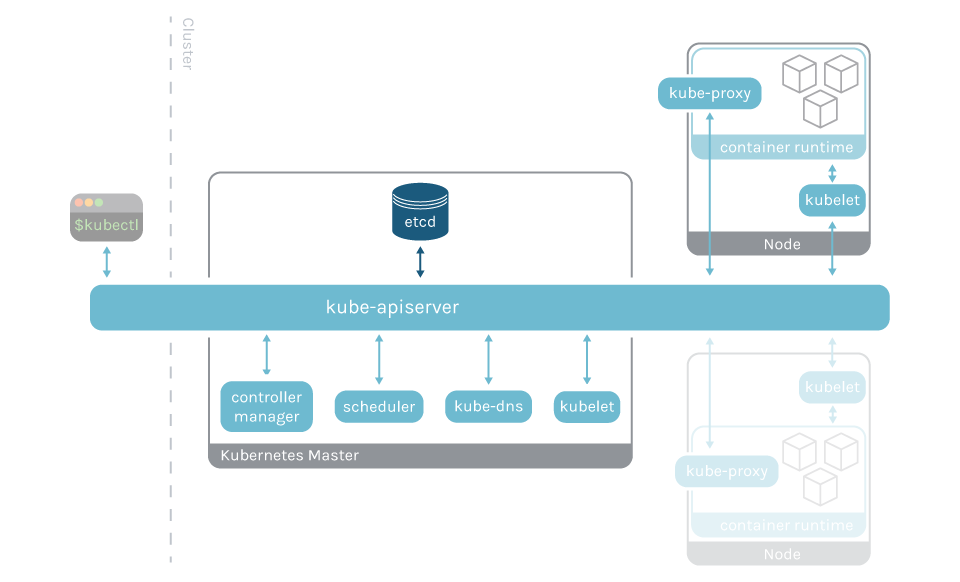
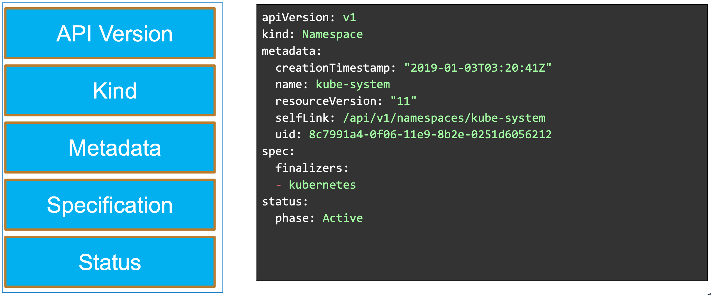
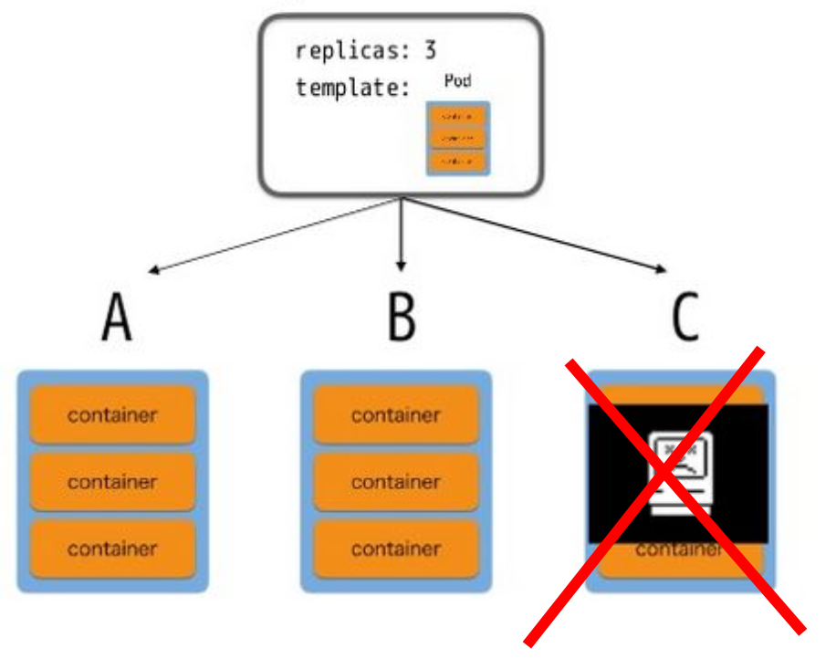
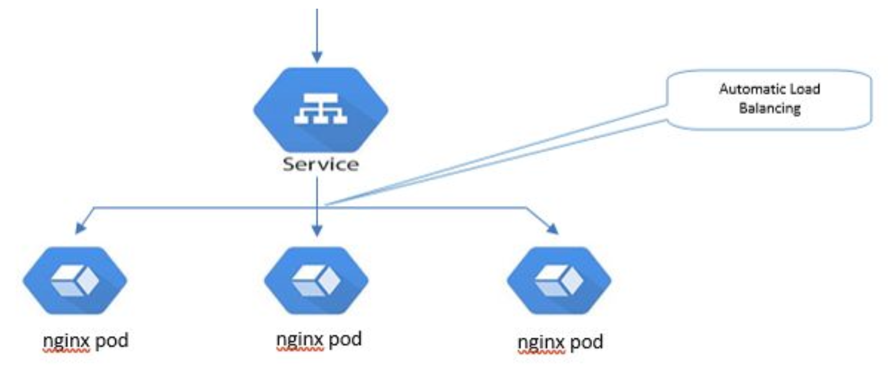
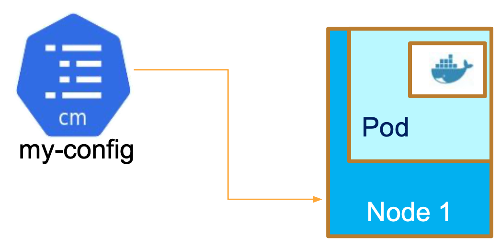

## What is Kubernetes?
* A tool and platform for deploying, scaling and maintaining containerized applications.
* It orchestrates computing, networking, and storage infrastructure on behalf of user workloads.
* Portable open-source platform.
* The goal of Kubernetes:
    * Move containers to “virtual hosts” (pods)
    * Logically abstract compute, network, storage

Key features of Kubernetes include:

* Autoscaling
* Container DNS
* Automated Cloud Resource provisioning
* Automated rescheduling of containers to new nodes.
* Support for Stateless and Stateful Workloads
* Networking Policies that can control access between containers

## Kubernetes Control Plane Components
The control plane components include the following key components:

* Kube-apiserver - exposes the k8s api and provides a web-base front end
* etcd - provides a key-value store used to store all the cluster data
* kube-scheduler - assigns new pods a node to run on
* kube-controller-manager - manages a collection of individual controller processes in a single binary


## Kubernetes Controllers
* A node controller that keeps track of node status and responds if nodes go down.
* An endpoints controller that populates endpoints.
* A service account and token controller that creates default accounts and access
tokens for new service namespaces.
* An optional cloud-controller-manager runs controllers that interact with the
underlying cloud providers.


## Kubernetes Worker Nodes
Worker nodes maintain running pods and provide the runtime environment for the native Kubernetes cluster. Each work node includes the following key components:
* The kubelet agent runs on each node in the cluster to ensure that the containers created by Kubernetes for a pod are running and in a healthy state.
* The kube-proxy serves as a network proxy that runs on each node in the cluster to enforce network routing and connection forwarding rules.
* The Kubernetes container runtime manages any supported type of container, such as Docker or containerd, that runs on the cluster.

## What does Kubernetes Look Like?




## Baisc Kubernetes Objects
K8 objects are persistent entities that represent the state of your cluster. They show what and where containerized apps are running, available resources, and applied policies.  They are most commonly describe in YAML files as shown below.



### Namespaces
* Logical Boundary within a Cluster
* Resource Boundary for workloads within the namespace
* Network boundary
* Example: 
    * kubernetes.default.svc.cluster.local
    * kubernetes.default


### Pods
* Basic building block of the Kubernetes model used to manage the container
* Consists of one or more containers, storage resources, and unique IP address in the Kubernetes cluster. (share namespace and storage)
    * Think of a pod as a wrapper for containers
* Kubernetes schedules pods to run on servers in the cluster, the server will run the containers that are part of that pod


### Deployments
* Deployments manages the scaling of pods, and ensures the expected Pod replica count is running in the cluster. (H.A.) + scalability
    * pod.1, pod.2, pod.3
* Deployments
    * Based on an identical pod spec o Rollout Strategies
    * Rollback support
    * Scaling
* Use Cases:
    * Stateless workloads (some exceptions)
    * Stateless Kubernetes uses a Deployment controller




### Services
* Provide a stable address to route traffic to pods
* Can load balance traffic to multiple pods
* Various types of services:
    * ClusterIP
    * Load Balancer
    * NodePort
    * External Name




### Config Map
* Stores configuration settings in the form of Key/Value pairs
* One key can hold an entire application configuration
* Can be mounted as a volume in a pod
* Use Case
    * Externalized Configuration





## The `kubectl` Utility
Primary interaction point for a user and Kubernetes Cluster.

* It is a Command Line Interface (CLI) tool
* Incredibly feature rich:
    * Search and output capabilities
    * Edit resources in place
    * Deploy and interact with workloads
    * Autocompletion
    * Supports declarative and imperative deployments

```shell
kubectl <verb> <objects> -n <namespace>
kubectl <verb> <objects> <specific-object> -n <namespace>
```