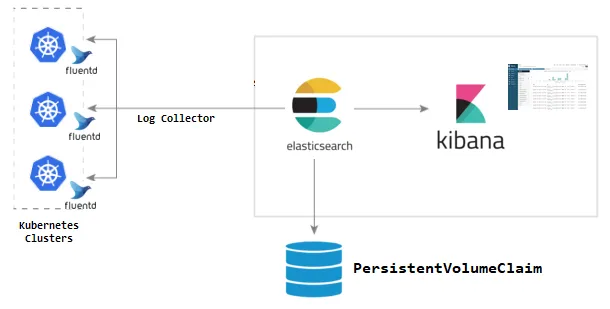
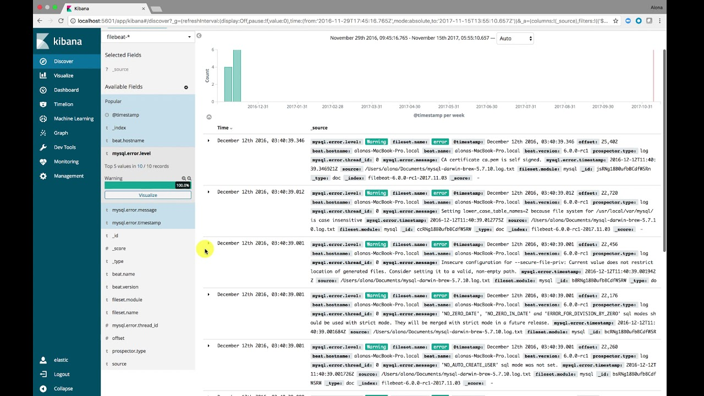
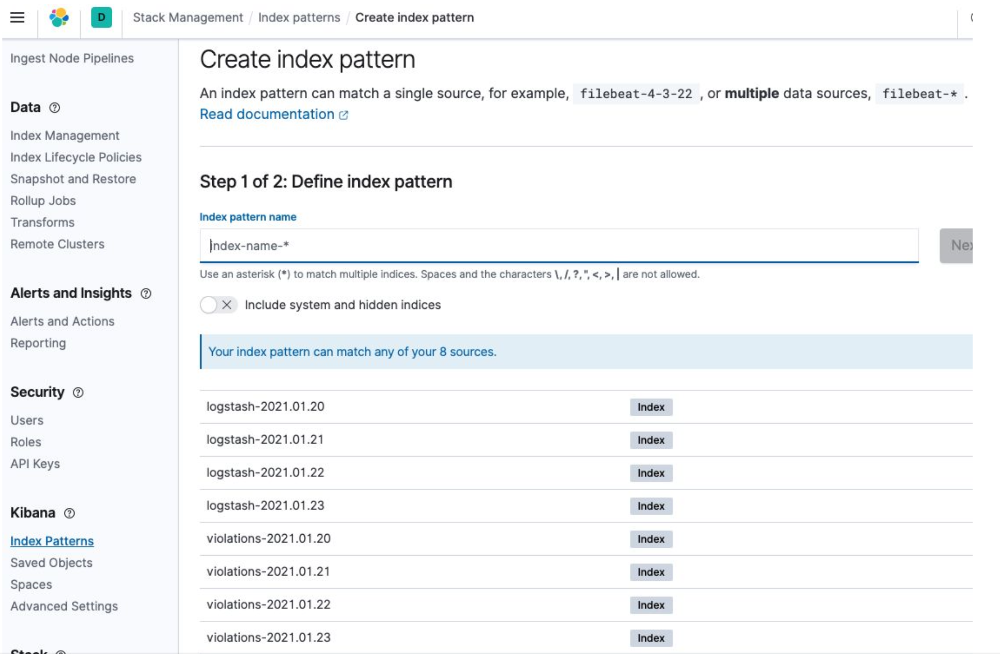

## What is Consolidated logging?
As complex systems are broken down into smaller parts, the number of individual components that generate log data increases, and these logs are spread across multiple servers and are in multiple formats.  Centralized logging is the process of collecting logs from networks, infrastructure, and applications into a single location for storage and analysis. This can provide administrators with a consolidated view of all activity across the network, making it easier to identify and troubleshoot issues.

## Consolidaed Logging Basics

* A typical logging stack is made of 3 pieces
    * **Collection/Shipper**: That consumes log outputs and sends them to the consolidated logging framework.
    * **Storage**: That stores the shipped logs.
    * **Visualization Tool**: Allows users to search and view log data.


* PlatformOne uses:
    * Fluentbit for log collection, transformation, and shipping
    * ElasticSearch for log storage
    * Kibana for visualization

The diagram below shows how these work together.  The diagram shows FluentD (another popular log collector), but the architecture is the same.




## Fluent Bit

* Deployed as a Daemonset in the cluster ○ Runs on both worker and master nodes
* Pushes logs to ES/ECK (Elastic Cloud on Kubernetes)
* BigBang configures ElasticSearch with Indexes
   * logstash index (which has all the Kubernetes pod logs)

## Elastic Cloud on Kubernetes

Elastic Cloud on Kubernetes (ECK) Helps ease the pain of Day 2 operations with ElasticSearch

Features include:

* Deploy and manage multiple Elasticsearch clusters, including Kibana
* Simple scaling that allows you to grow with your cluster
*  Default security on every cluster


**Day 1 Operations**
1. Deploy the elastic-operator
2. Deploy an elasticsearch cluster
3. Deploy a kibana instance

**Day 2 Operations**
* Upgrading to newer versions
* Scaling up to handle increased load

### Instalation
ECK is Deployed using the Operator pattern

* ECK simplifies installing elasticsearch through the use of Custom Resource Definitions
* This is a simple example, but even the one for BigBang declaratively describes an Elastic Cluster in 189 lines
* Scaling the cluster can be done by simply increasing the count


```bash
kubectl get elasticsearch logging-ek -n=logging -o yaml | wc -l
```

```yaml
apiVersion: elasticsearch.k8s.elastic.co/v1
kind: Elasticsearch
metadata:
  name: quickstart
spec:
  version: 7.8.0
  nodeSets:
  - name: default
    count: 1
    config:
      node.master: true
      node.data: true
      node. ingest: true
      node.store.allow mmap: false
```

## Kibana



* UI for searching through indexed logs
* Critical due to the short-lived nature of kubernetes pods
    * Historical logs can be difficult to obtain from kubectl
* First time login into Kibana will require configuration of the index patterns
    * Every Day an Index will be created for kubernetes log's and open policy agent gatekeeper logs (This helps with rotating/compressing/exporting and then deleting older logs over time so as
not to run out of space)
    * Index Pattern will look like logstash-* or violations-*

 

