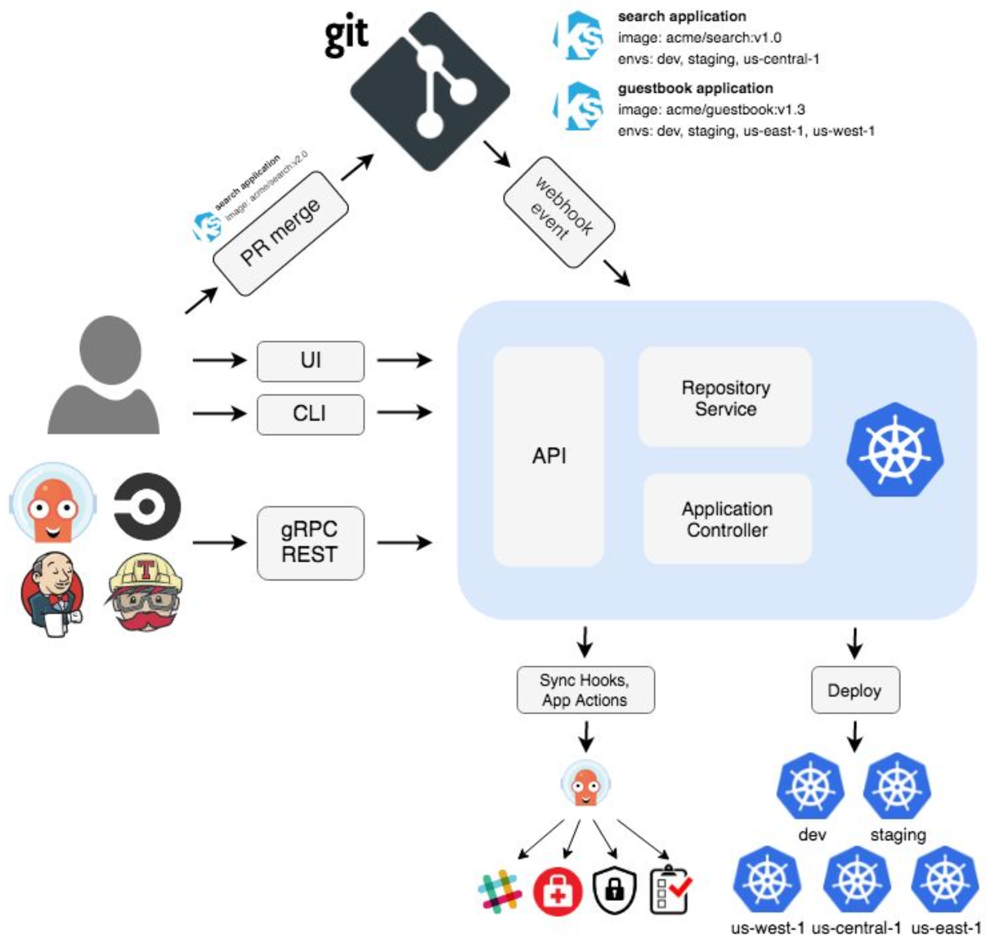

## What is GitOps?

* A set of practices built around using Git as your system’s source of truth.
* GitOps requires the desired state of the system to be stored in version control.
* GitOps and Kubernetes typically go hand-in-hand the mission here being your “system” consists of kubernetes-based infrastructure and the applications on top.
* Define your apps and k8s infra declaratively with k8s manifest files.

## Benefits of GitOps

* Traceability - Knowing who did what
* Transparency - Knowing “what” is there
* Knowledge Sharing via Git - allows people to easily understand your system from code rather than digging into the system itself (think using kubectl commands instead of reading manifest files from one location)
* Deployments are easier - you only have to make commits to a branch on git
* Tooling has matured to:
    * Perform state management for your cluster + resources
    * Perform the actually deployment of resources to the cluster & cloud infrastructure

## GitOps Flow

1. Operator (Human/Bot) creates a branch
2. Operator (Human/Bot) creates a Pull Request
3. PR Merged and approved
4. GitOps tool polls for changes (ArgoCD)
5. Changes are applied to the cluster

## Flux v2

* Flux v2 is a GitOps tool that synchronizes configuration from a git repository into a given Kubernetes Cluster
* Ability to Deploy
    * Kustomize
    * Helm Charts
    * Yaml Manifests
* Flux has a CLI tool for installing and interacting with Flux

## CRDs and Flux

* Flux is stateless and uses Custom Resources (CR) to store its state
* Custom Resource Definitions are a way to extend the functionality of Kubernetes by allowing you to create your own api objects and operators
* Allows multiple ways to interact with Flux
    * Flux CLI
    * Applying kubernetes objects
    * Apply changes to the Git Repo

## Flux Architecture

