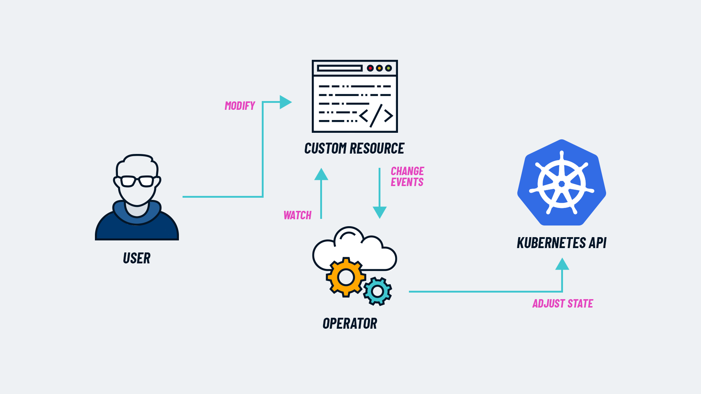

## What is an Operator?
A Kubernetes Operator is a software bot that can do tasks in place of a Human IT Operations personnel.

Kubernetes Operator's are created by taking the knowledge and experience of a human IT operator and codifying it into an an automated software bot, the software bot runs as a systemd service or pod running on the cluster and uses Custom Resources to configure its desired end state.

## Comparison to Controllers
The Kubernetes Controller Manager runs as a pod or systemd service. It's acts as a reconciliation loop that ensures actual state ='s desired state. Kubernetes deployment declaratively defines the desired number of replicas. The Kubernetes Controller Manager brings that desired state into reality and ensures that stays true over time. The controller manager spins up the pods associated with a deployment.

**Difference between a Kubernetes Controller and a Kubernetes Operator**:

**Controller**: Uses built in objects like `pod`, `deployment`, `statefulset`, `ingress`, etc. to define the desired end state.

**Operator**: Uses Custom Resources like `GitRepository`, `HelmRelease`, `Kustomization` etc to defined the desired state.

Custom Resources use [Custom Resource Definitions](https://kubernetes.io/docs/concepts/extend-kubernetes/api-extension/custom-resources/) to extend the Kubernetes API to create newly recognized Kubernetes YAML object types.

## The Operator Pattern

Kubernetes Operator Pattern:
* A CRD (Custom Resoruce Definitiion) defines a new configuraiton API.
* A CR (Custom Resource), acts as the Declarative Configuration (governed by the CRD) that defines the desired end state.
* An "Operator" (software bot running as a pod on Kubernetes or systemd service), acts as the abstraction layer necessary to achieve the desired end state, as defined by the CR.

**Definition from the official docs:**
The Operator pattern aims to capture the key aim of a human operator who is managing a service or set of services. Human operators who look after specific applications and services have deep knowledge of how the system ought to behave, how to deploy it, and how to react if there are problems.

Source: [https://www.cncf.io/blog/2022/06/15/kubernetes-operators-what-are-they-some-examples/](https://www.cncf.io/blog/2022/06/15/kubernetes-operators-what-are-they-some-examples/)

## Big Bang Examples

* Flux (GitRepository, HelmRelease, Kustomization)
* ArgoCD (AppProject, Application)
* Istio (Gateway, VirtualService, DestinationRule, EnvoyFilter)
* Prometheus Operator Stack (Prometheus, ServiceMonitor)
* ECK: Elastic Cloud on Kubernetes (ElasticSearch)

So:

* Create a GitRepository CR a Git Repository is created in the cluster. 
* Create a HelmRelease CR a Helm Chart is applied to the Cluster.
* Create a ElasticSearch CR an ElasticSearch Cluster will be deployed in the Cluster.
* .. etc.