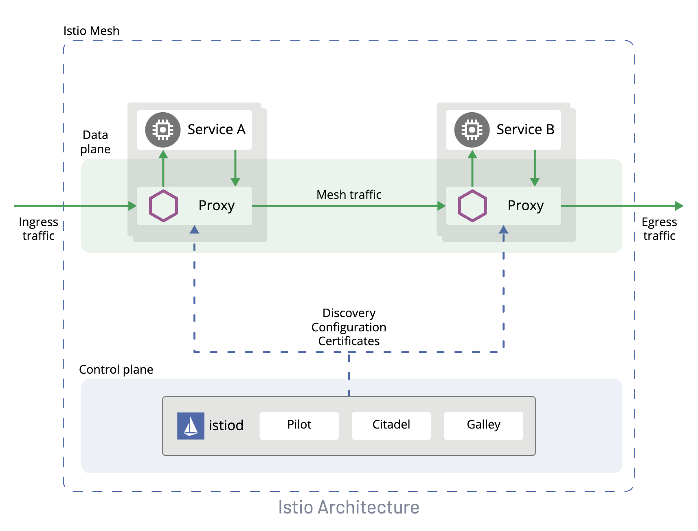
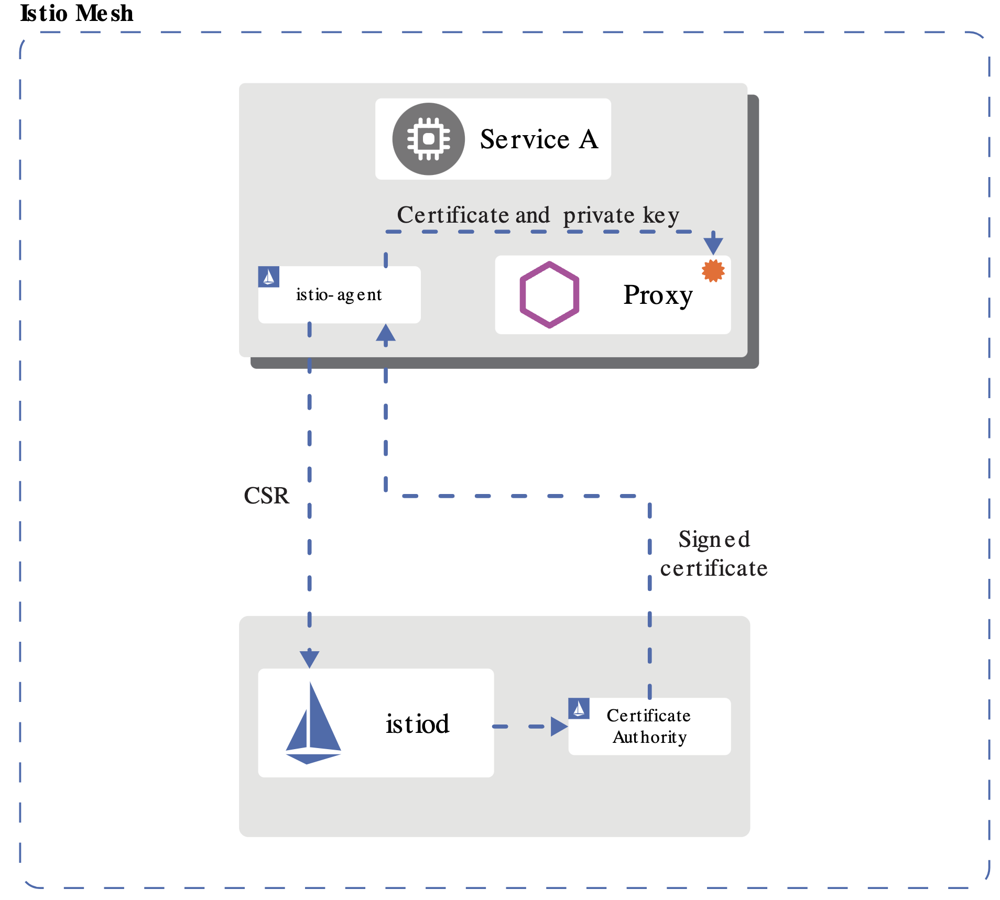
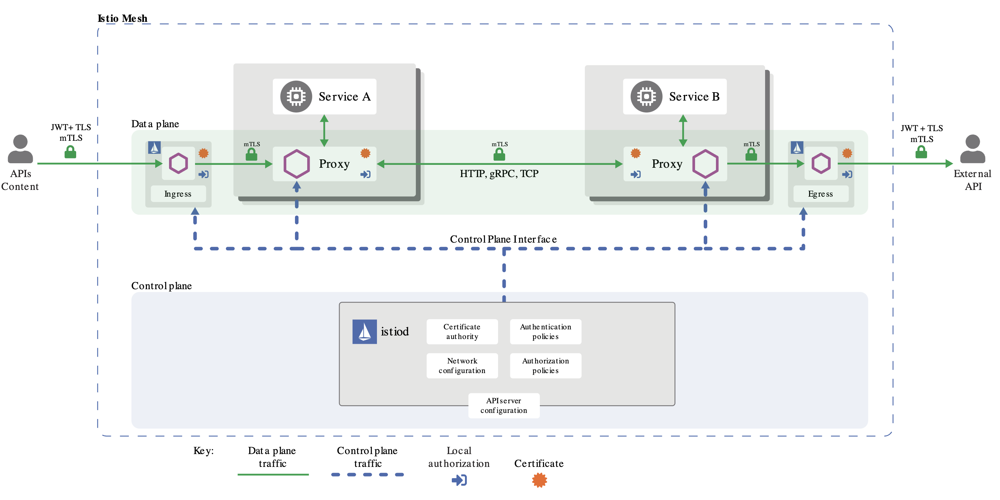

## What is a Service Mesh?
* In software architecture, a service mesh is a dedicated infrastructure layer for facilitating service-to-service communications between microservices, often using a sidecar proxy.
* Traffic management
  * e.g routing rules, request based routing, canary testing etc
* Security
  * e.g. zero trust network, traffic encryption
* Observability
  * e.g logging and dashboard and metrics


## The Sidecar Pattern

“Segregating the functionalities of an application into a separate process. Deploy components of an application into a separate process or container to provide isolation and encapsulation.”

When implementing a sidecar, the containers inside of a pod, don't directly communicate with the outside world.  Instead an additional container(s) are added to the pod that can both mediate the communication in/out of the pod as well as perform other security focused ativites that islotate the pod from the rest of the infrastructure.


## What is Istio?

Istio is an open source project that provides a service mesh implementaiton geared towards Kubernetes environments.


## Istio Architecture

Istio provides a **Data Plane** that handles commincation among the containers in the deployed pods, as well as a **Control Plane** that controls and confiures the service mesh itself.

* Data Plane
  * Envoy (sidecar proxy)
* Control Plane
  * IstioD
    * Pilot
    * Citadel
    * Galley
    * Mixer




Source: https://istio.io/latest/docs/ops/deployment/architecture/

## Istio CA

* Istio manages its own internal CA
* Similar to how Kubernetes Manages its own internal CA
* (These are decoupled from user facing HTTPS CA / no need to integrate)



Source: [https://istio.io/latest/docs/concepts/security/](https://istio.io/latest/docs/concepts/security/)


## Sidecar Injection
The sidecars must be added to the pod when pods are deployed.  There are two strategeis for this:

* Manual injection
  * Manual injection (using istioctl) directly modifies configuration, like deployments, and injects the proxy configuration into it.
* Automatic injection
  * Sidecars can be automatically added to applicable
  * Kubernetes pods using a mutating webhook admission controller provided by Istio.


P1 uses Automatic Injection, so no changes needed to application code and infrastructure.


## Traffic Management

Source: [https://istio.io/v1.4/docs/concepts/traffic-management/](https://istio.io/v1.4/docs/concepts/traffic-management/)

### Virtual Services
Virtual services, along with destination rules, are the key building blocks of Istio’s traffic routing functionality. A virtual service lets you configure how requests are routed to a service within an Istio service mesh, building on the basic connectivity and discovery provided by Istio and your platform. Each virtual service consists of a set of routing rules that are evaluated in order, letting Istio match each given request to the virtual service to a specific real destination within the mesh. Your mesh can require multiple virtual services or none depending on your use case.

The following virtual service routes requests to different versions of a service depending on whether the request comes from a particular user.

```yaml
apiVersion: networking.istio.io/v1alpha3
kind: VirtualService
metadata:
  name: reviews
spec:
  hosts:
  - reviews
  http:
  - match:
    - headers:
        end-user:
          exact: jason
    route:
    - destination:
        host: reviews
        subset: v2
  - route:
    - destination:
        host: reviews
        subset: v3
```

### Destination rules
Along with virtual services, destination rules are a key part of Istio’s traffic routing functionality. You can think of virtual services as how you route your traffic to a given destination, and then you use destination rules to configure what happens to traffic for that destination. Destination rules are applied after virtual service routing rules are evaluated, so they apply to the traffic’s “real” destination.

In particular, you use destination rules to specify named service subsets, such as grouping all a given service’s instances by version. You can then use these service subsets in the routing rules of virtual services to control the traffic to different instances of your services.

The following example destination rule configures three different subsets for the my-svc destination service, with different load balancing policies:

```yaml
apiVersion: networking.istio.io/v1alpha3
kind: DestinationRule
metadata:
  name: my-destination-rule
spec:
  host: my-svc
  trafficPolicy:
    loadBalancer:
      simple: RANDOM
  subsets:
  - name: v1
    labels:
      version: v1
  - name: v2
    labels:
      version: v2
    trafficPolicy:
      loadBalancer:
        simple: ROUND_ROBIN
  - name: v3
    labels:
      version: v3
```


### Gateways

You use a gateway to manage inbound and outbound traffic for your mesh, letting you specify which traffic you want to enter or leave the mesh. Gateway configurations are applied to standalone Envoy proxies that are running at the edge of the mesh, rather than sidecar Envoy proxies running alongside your service workloads.

The following example shows a possible gateway configuration for external HTTPS ingress traffic:

```yaml
apiVersion: networking.istio.io/v1alpha3
kind: Gateway
metadata:
  name: ext-host-gwy
spec:
  selector:
    app: my-gateway-controller
  servers:
  - port:
      number: 443
      name: https
      protocol: HTTPS
    hosts:
    - ext-host.example.com
    tls:
      mode: SIMPLE
      serverCertificate: /tmp/tls.crt
      privateKey: /tmp/tls.key
```

## Istio Security
Breaking down a monolithic application into atomic services offers various benefits, including better agility, better scalability and better ability to reuse services. However, microservices also have particular security needs:

* To defend against man-in-the-middle attacks, they need traffic encryption.
* To provide flexible service access control, they need mutual TLS and fine-grained access policies.
* To determine who did what at what time, they need auditing tools.

Istio Security provides a comprehensive security solution to solve these issues. This page gives an overview on how you can use Istio security features to secure your services, wherever you run them. In particular, Istio security mitigates both insider and external threats against your data, endpoints, communication, and platform.

Istio can run in multiple profiles, we use default profile that doesn't deploy an Egress Gateway. (So BigBang Deployments default to having an Ingress Gateway but not an Egress Gateway)



Source: [https://istio.io/latest/docs/concepts/security/](https://istio.io/latest/docs/concepts/security/)


## Istio Observability

Istio generates detailed telemetry for all service communications within a mesh. This telemetry provides observability of service behavior, empowering operators to troubleshoot, maintain, and optimize their applications – without imposing any additional burdens on service developers. Through Istio, operators gain a thorough understanding of how monitored services are interacting, both with other services and with the Istio components themselves.

Istio generates the following types of telemetry in order to provide overall service mesh observability:

* **Metrics**: Istio generates a set of service metrics based on the four “golden signals” of monitoring (latency, traffic, errors, and saturation). Istio also provides detailed metrics for the mesh control plane. A default set of mesh monitoring dashboards built on top of these metrics is also provided.
* **Distributed Trace**:  Istio generates distributed trace spans for each service, providing operators with a detailed understanding of call flows and service dependencies within a mesh.
* **Access Logs** As traffic flows into a service within a mesh, Istio can generate a full record of each request, including source and destination metadata. This information enables operators to audit service behavior down to the individual workload instance level.