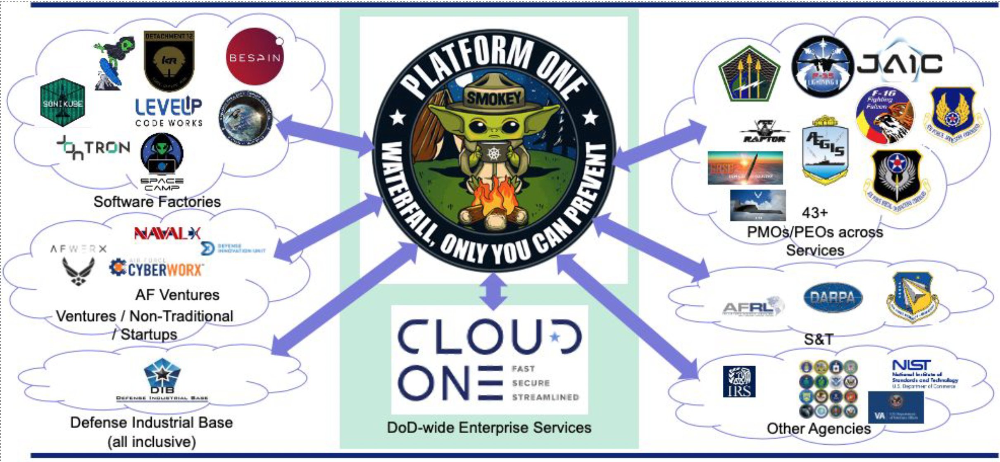
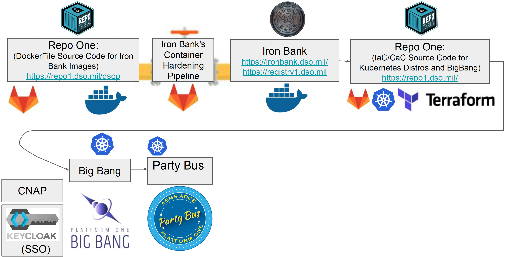

## What is Platform One?
Platform One (P1) is a security-first approach to modern software development for military weapon systems that leverages industry best-practices. P1 enables the DoD to operate using DevSecOps managed internally. P1 is comprised of huge team that was formed from merging top talent across the U.S. Air Force and other innovation hubs. Platform One allows users to deploy a DevSecOps Software Factory and start solving software problems with a 90% solution day 1, instead of starting from nothing.

More informatio on Platform One can be found at https://p1.dso.mil/

## How the P1 Services Fit Together
Big Bang turns Iron Bank Container Images into Deployable Apps Repo One, Iron Bank, Party Bus, SSO, and more are all hosted on instances of Big Bang

