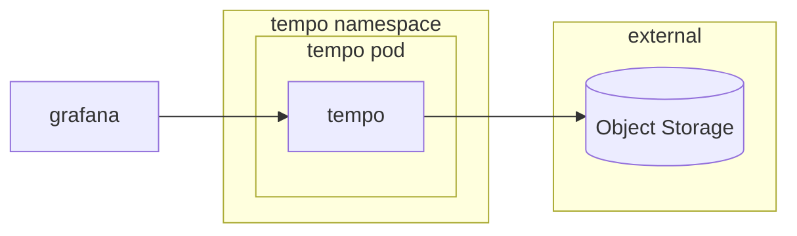
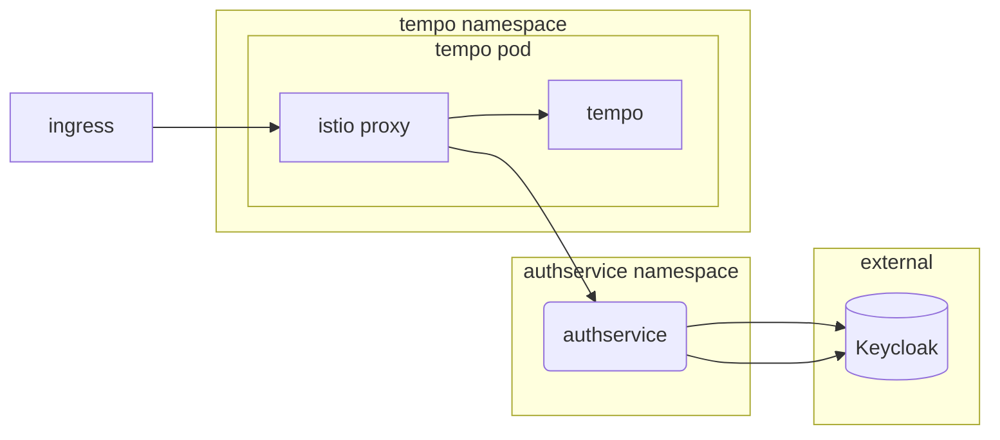

# Tempo

## Overview

This package contains an extensible and configurable installation of Grafana Tempo based on the upstream chart provided by grafana. Tempo can be used to collect traces from your cluster service-mesh. Grafana has a built-in data source that can be used to query Tempo and visualize traces.

[Tempo](https://grafana.com/docs/tempo/latest/) is an open source, easy-to-use, and high-scale distributed tracing backend. With Tempo, the only dependencyis object storage (e.g., S3, Azure Blob, etc.). Tempo can ingest common open source tracing protocols, including Jaeger, Zipkin, and OpenTelemetry.


### Grafana Tempo



For more information on the Anchore Enterprise architecture, see [Enterprise Service Overview and Architecture](https://docs.anchore.com/current/docs/overview/architecture/).

## Big Bang Touch Points

### Licensing

Tempo has no licensing options nor requirements.

For production workloads, Grafana has a built in Tempo data source that can be used to query Tempo and visualize traces.

### Single Sign On

Tempo does not have built in SSO. In order to provide SSO, this deployment leverages Authservice

1. Create a Tempo client
   - Change the following configuration items
      - access type: confidential _this will enable a "Credentials" tab within the client configuration page_
      - Direct Access Grants Enabled: Off
      - Valid Redirect URIs: https://tracing.${DOMAIN}/login
        - If you want to deploy both Jaeger and Tempo at the same time you should set this to https://tempo.${DOMAIN}/login
      - Base URL: https://tracing.${DOMAIN}
        - If you want to deploy both Jaeger and Tempo at the same time you should set this to https://tempo.${DOMAIN}
    - Take note of the client secret in the credentials tab

2. Deploy from Big Bang with the SSO values set:
  ```yaml
  tempo:
    sso:
      enabled: true
      client_id: <id for client you created>
      client_secret: <client secret from the credentials tab>
  ```

3. Tempo will be deployed with Authservice protecting the UI behind your SSO provider.


### Storage

Tempo has a dependency on object storage (e.g., GCS, S3, Azure Blob). To set a preferred object storage option in the bigang values reference the values below:

```yaml
tempo:
  enabled: true
  objectstorage:
    # -- S3 compatible endpoint to use for connection information.
    # examples: "s3.amazonaws.com" "s3.us-gov-west-1.amazonaws.com" "minio.minio.svc.cluster.local:9000"
    # Note: tempo does not require protocol prefix for URL.
    endpoint: ""

    # -- S3 compatible region to use for connection information.
    region: ""

    # -- Access key for connecting to object storage endpoint.
    accessKey: ""

    # -- Secret key for connecting to object storage endpoint.
    # Unencoded string data. This should be placed in the secret values and then encrypted
    accessSecret: ""

    # -- Bucket Names for Loki as a comma delimited list.
    # examples: "tempo-traces"
    bucket: ""

    # -- Whether or not objectStorage connection should require HTTPS, if connecting to in-cluster object
    # storage on port 80/9000 set this value to true.
    insecure: false
```

### UI

Tempo has no UI packaged with it. Grafana is the frontend to view traces.

### Logging

Within Big Bang, logs are captured by fluentbit or promtail and shipped to your logging engine (Loki when ECK not installed, ECK when it's installed or both).

### Health Checks

When the global override strategy endpoint is configured within Tempo [Consistent Hash Rings](https://grafana.com/docs/tempo/latest/operations/consistent_hash_ring/) (e.g., distributor, ingester, metrics-generator, and compactor) will display web pages with the individual hash ring status, including the state, health, and last heartbeat time of each metrics-generator.
